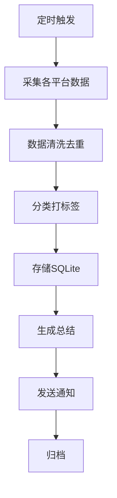

# 提案 04: 系统架构与定时任务

## 整体架构

```
┌─────────────────────────────────────────────────────────────┐
│                    Everyday News System                      │
├─────────────────────────────────────────────────────────────┤
│                                                              │
│  ┌─────────────┐  ┌─────────────┐  ┌─────────────┐        │
│  │ Scheduler   │  │ Collector   │  │  Database   │        │
│  │ (Cron)      │─▶│ (Playwright)│─▶│  (SQLite)   │        │
│  └─────────────┘  └─────────────┘  └──────┬──────┘        │
│       │                                    │                │
│       │                                    ▼                │
│       │                          ┌─────────────────┐        │
│       │                          │   Daily Summary │        │
│       │                          │   (Claude LLM)  │        │
│       │                          └────────┬────────┘        │
│       │                                   │                 │
│       ▼                                   ▼                 │
│  ┌─────────────────────────────────────────────┐           │
│  │              Notification                    │           │
│  │  - Telegram  - Email  - Webhook             │           │
│  └─────────────────────────────────────────────┘           │
│                                                              │
└─────────────────────────────────────────────────────────────┘
```

## 定时任务配置

| 任务 | 时间 (UTC) | 说明 |
|------|------------|------|
| Twitter 采集 | 0,6,12,18 * * * | 每6小时 |
| YouTube 采集 | 6,18 * * * | 每12小时 |
| TikTok 采集 | 6,18 * * * | 每12小时 |
| 微博 采集 | 0,6,12,18 * * * | 每6小时 |
| 抖音 采集 | 6,18 * * * | 每12小时 |
| 总结生成 | 2,14 * * * | 每天2次 |
| 数据清理 | 0 * * 0 | 每周清理 |

## 数据流



## 错误处理

- 采集失败: 重试3次，间隔5分钟
- LLM 调用失败: 降级为简单模板
- 数据库错误: 事务回滚 + 告警

## 监控指标

- 采集成功率
- 数据完整性
- 总结生成耗时
- API 调用成本

## 决策

使用 ccr code 集成 Claude LLM 调用，通过 ccr cron 定时任务驱动。
