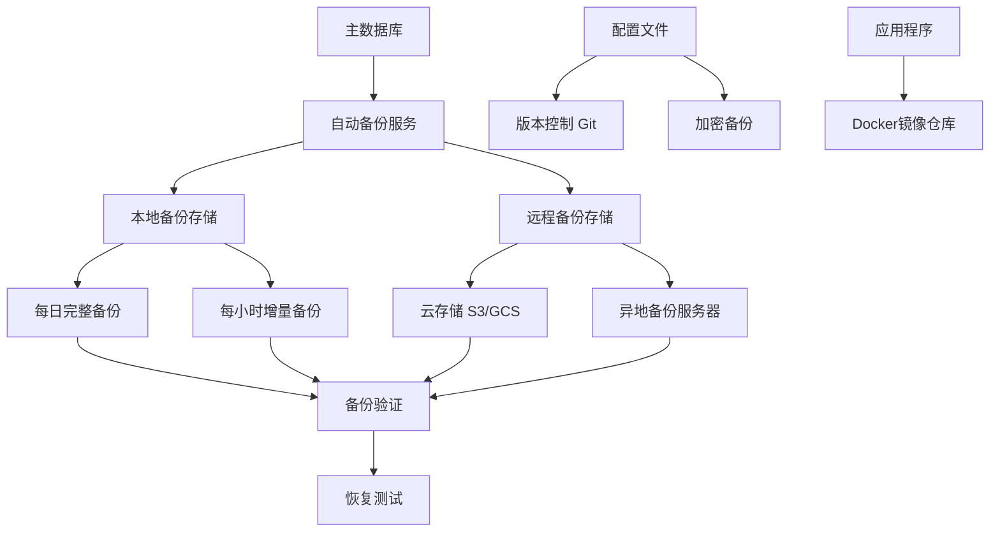

# 备份与恢复流程文档

## 备份策略概述

系统采用多层备份策略，确保数据安全性和可恢复性。备份策略基于以下原则设计：
- **3-2-1原则**: 3份数据副本，2种不同介质，1份异地备份
- **自动化优先**: 尽可能自动化备份过程
- **定期验证**: 定期测试备份的可恢复性
- **分级存储**: 根据数据重要性采用不同的备份频率和保留期

## 备份架构



## 备份组件

### 1. 数据库备份
- **主数据库**: SQLite (`./data/everyday_news.db`)
- **监控数据库**: SQLite (`./data/metrics.db`)
- **备份格式**: SQLite原生格式、SQL导出、压缩包

### 2. 配置文件备份
- 环境变量文件 (`.env.prod`, `.env.staging`, `.env.dev`)
- 配置文件 (`config/` 目录)
- 部署脚本 (`scripts/` 目录)

### 3. 应用程序备份
- Docker镜像
- 源代码仓库
- 依赖包清单

## 备份配置

### 自动备份服务配置

#### Docker Compose配置
```yaml
# docker-compose.yml 中的备份服务
backup:
  build: .
  container_name: everyday-news-backup
  restart: unless-stopped
  command: ["npm", "run", "db:backup:auto"]
  environment:
    - NODE_ENV=${NODE_ENV:-production}
    - DATABASE_PATH=/app/data/everyday_news.db
    - BACKUP_PATH=/app/data/backups
    - BACKUP_TYPE=${BACKUP_TYPE:-full}
    - BACKUP_RETENTION_DAYS=${BACKUP_RETENTION_DAYS:-7}
    - BACKUP_COMPRESS=${BACKUP_COMPRESS:-true}
    - BACKUP_AUTO_INTERVAL=${BACKUP_AUTO_INTERVAL:-86400}
  volumes:
    - everyday-news-data:/app/data
    - everyday-news-backups:/app/data/backups
    - ./config:/app/config:ro
  networks:
    - everyday-news-network
  depends_on:
    - app
```

#### 环境变量配置
```bash
# 备份配置环境变量
BACKUP_TYPE=full                   # 备份类型: full, incremental, differential
BACKUP_RETENTION_DAYS=7            # 保留天数
BACKUP_COMPRESS=true               # 是否压缩
BACKUP_COMPRESSION_LEVEL=6         # 压缩级别 (1-9)
BACKUP_AUTO_INTERVAL=86400         # 自动备份间隔 (秒)
BACKUP_MAX_SIZE=1073741824         # 最大备份大小 (1GB)

# 加密配置 (可选)
BACKUP_ENCRYPT=false               # 是否加密备份
BACKUP_ENCRYPTION_KEY=${BACKUP_ENCRYPTION_KEY}
BACKUP_ENCRYPTION_ALGORITHM=aes-256-gcm

# 远程备份配置
BACKUP_REMOTE_ENABLED=false        # 是否启用远程备份
BACKUP_REMOTE_TYPE=s3              # 远程类型: s3, gcs, ftp, scp
BACKUP_REMOTE_PATH=s3://your-bucket/backups/everyday-news/
BACKUP_REMOTE_ACCESS_KEY=${AWS_ACCESS_KEY_ID}
BACKUP_REMOTE_SECRET_KEY=${AWS_SECRET_ACCESS_KEY}
BACKUP_REMOTE_REGION=${AWS_REGION}
```

#### 备份计划配置
```yaml
# config/backup.yaml
backup:
  # 完整备份计划
  full:
    schedule: "0 2 * * *"          # 每天凌晨2点
    retention: 7                   # 保留7天
    compression: true
    encryption: false

  # 增量备份计划
  incremental:
    schedule: "0 */6 * * *"        # 每6小时
    retention: 3                   # 保留3天
    compression: true
    encryption: false

  # 差异备份计划 (可选)
  differential:
    schedule: "0 12,18 * * *"      # 每天中午12点和下午6点
    retention: 2                   # 保留2天
    compression: true
    encryption: false

  # 实时备份 (WAL模式)
  realtime:
    enabled: true
    wal_keep_segments: 10          # 保留WAL段数量
    checkpoint_timeout: 300        # 检查点超时 (秒)

  # 验证计划
  verification:
    schedule: "0 3 * * *"          # 每天凌晨3点验证前一天的备份
    method: checksum               # 验证方法: checksum, restore_test
    notify_on_failure: true        # 验证失败时通知
```

### 备份脚本

#### 主备份脚本
```bash
#!/bin/bash
# scripts/backup.sh - 完整备份脚本

set -euo pipefail

# 配置
BACKUP_DIR="${BACKUP_DIR:-./backups}"
TIMESTAMP=$(date +%Y%m%d_%H%M%S)
BACKUP_NAME="everyday_news_backup_${TIMESTAMP}"
LOG_FILE="${BACKUP_DIR}/backup_${TIMESTAMP}.log"

# 颜色输出
RED='\033[0;31m'
GREEN='\033[0;32m'
YELLOW='\033[1;33m'
NC='\033[0m' # No Color

log_info() {
    echo -e "${GREEN}[INFO]${NC} $1" | tee -a "$LOG_FILE"
}

log_warn() {
    echo -e "${YELLOW}[WARN]${NC} $1" | tee -a "$LOG_FILE"
}

log_error() {
    echo -e "${RED}[ERROR]${NC} $1" | tee -a "$LOG_FILE"
}

# 创建备份目录
create_backup_dir() {
    mkdir -p "$BACKUP_DIR"
    mkdir -p "${BACKUP_DIR}/daily"
    mkdir -p "${BACKUP_DIR}/weekly"
    mkdir -p "${BACKUP_DIR}/monthly"
    mkdir -p "${BACKUP_DIR}/logs"
}

# 备份数据库
backup_database() {
    local db_file="./data/everyday_news.db"
    local backup_file="${BACKUP_DIR}/daily/${BACKUP_NAME}.db"

    log_info "开始备份数据库..."

    # 检查数据库文件
    if [[ ! -f "$db_file" ]]; then
        log_error "数据库文件不存在: $db_file"
        return 1
    fi

    # 执行备份
    if command -v sqlite3 &> /dev/null; then
        # 使用 .backup 命令创建热备份
        sqlite3 "$db_file" ".backup '${backup_file}'"

        # 验证备份
        if sqlite3 "${backup_file}" "SELECT count(*) FROM sqlite_master;" &> /dev/null; then
            log_info "数据库备份成功: ${backup_file}"
            echo "${backup_file}" > "${BACKUP_DIR}/latest_db_backup.txt"
        else
            log_error "数据库备份验证失败"
            return 1
        fi
    else
        # 简单文件拷贝（需要数据库没有写入）
        cp "$db_file" "$backup_file"
        log_info "数据库文件拷贝完成: ${backup_file}"
    fi

    # 计算备份大小
    local size=$(du -h "$backup_file" | cut -f1)
    log_info "备份文件大小: $size"
}

# 备份配置文件
backup_configs() {
    local config_backup="${BACKUP_DIR}/daily/${BACKUP_NAME}_configs.tar.gz"

    log_info "开始备份配置文件..."

    tar -czf "$config_backup" \
        .env.prod .env.staging .env.dev \
        config/ \
        scripts/ \
        package.json \
        package-lock.json \
        2>/dev/null || true

    if [[ -f "$config_backup" ]]; then
        log_info "配置文件备份成功: ${config_backup}"
        echo "${config_backup}" > "${BACKUP_DIR}/latest_config_backup.txt"
    else
        log_warn "配置文件备份失败或没有配置文件"
    fi
}

# 备份日志文件（可选）
backup_logs() {
    local logs_backup="${BACKUP_DIR}/daily/${BACKUP_NAME}_logs.tar.gz"

    log_info "开始备份日志文件..."

    if [[ -d "./logs" ]] && [[ -n "$(ls -A ./logs/ 2>/dev/null)" ]]; then
        tar -czf "$logs_backup" ./logs/ 2>/dev/null || true
        log_info "日志文件备份成功: ${logs_backup}"
    else
        log_info "没有日志文件需要备份"
    fi
}

# 创建备份清单
create_manifest() {
    local manifest="${BACKUP_DIR}/daily/${BACKUP_NAME}_manifest.json"

    cat > "$manifest" << EOF
{
  "backup": {
    "name": "${BACKUP_NAME}",
    "timestamp": "${TIMESTAMP}",
    "type": "full",
    "components": {
      "database": "$(ls -1 ${BACKUP_DIR}/daily/${BACKUP_NAME}.db 2>/dev/null || echo "not_found")",
      "configs": "$(ls -1 ${BACKUP_DIR}/daily/${BACKUP_NAME}_configs.tar.gz 2>/dev/null || echo "not_found")",
      "logs": "$(ls -1 ${BACKUP_DIR}/daily/${BACKUP_NAME}_logs.tar.gz 2>/dev/null || echo "not_found")"
    },
    "system": {
      "hostname": "$(hostname)",
      "user": "$(whoami)",
      "disk_usage": "$(df -h . | tail -1)"
    },
    "application": {
      "version": "$(node -e "console.log(require('./package.json').version || 'unknown')" 2>/dev/null || echo "unknown")",
      "node_version": "$(node --version)",
      "npm_version": "$(npm --version)"
    }
  }
}
EOF

    log_info "备份清单创建完成: ${manifest}"
}

# 清理旧备份
cleanup_old_backups() {
    local retention_days=${BACKUP_RETENTION_DAYS:-7}

    log_info "清理 ${retention_days} 天前的旧备份..."

    # 清理每日备份
    find "${BACKUP_DIR}/daily" -name "*.db" -mtime +${retention_days} -delete
    find "${BACKUP_DIR}/daily" -name "*.tar.gz" -mtime +${retention_days} -delete
    find "${BACKUP_DIR}/daily" -name "*.json" -mtime +${retention_days} -delete
    find "${BACKUP_DIR}/daily" -name "*.log" -mtime +${retention_days} -delete

    # 清理空目录
    find "${BACKUP_DIR}" -type d -empty -delete

    log_info "旧备份清理完成"
}

# 验证备份完整性
verify_backup() {
    local db_backup="${BACKUP_DIR}/daily/${BACKUP_NAME}.db"

    log_info "验证备份完整性..."

    if [[ -f "$db_backup" ]]; then
        # 验证数据库文件
        if sqlite3 "$db_backup" "SELECT count(*) FROM sqlite_master;" &> /dev/null; then
            log_info "数据库备份验证通过"
        else
            log_error "数据库备份验证失败"
            return 1
        fi
    fi

    # 验证配置文件备份
    local config_backup="${BACKUP_DIR}/daily/${BACKUP_NAME}_configs.tar.gz"
    if [[ -f "$config_backup" ]]; then
        if tar -tzf "$config_backup" &> /dev/null; then
            log_info "配置文件备份验证通过"
        else
            log_error "配置文件备份验证失败"
            return 1
        fi
    fi

    log_info "所有备份验证通过"
}

# 发送备份通知
send_notification() {
    local status=$1
    local message=$2

    log_info "发送备份通知..."

    # 使用系统通知发送备份结果
    if command -v curl &> /dev/null; then
        curl -X POST http://localhost:3000/notification/send \
            -H "Content-Type: application/json" \
            -d "{
                \"title\": \"数据库备份 ${status}\",
                \"content\": \"${message}\",
                \"priority\": \"medium\"
            }" 2>/dev/null || log_warn "无法发送通知"
    fi
}

# 主函数
main() {
    log_info "开始备份流程: ${TIMESTAMP}"

    # 创建备份目录
    create_backup_dir

    # 执行备份
    local success=true
    backup_database || success=false
    backup_configs || success=false
    backup_logs || true  # 日志备份可选

    if [[ "$success" == true ]]; then
        # 创建清单和验证
        create_manifest
        verify_backup || success=false

        if [[ "$success" == true ]]; then
            # 清理旧备份
            cleanup_old_backups

            local message="备份成功完成: ${BACKUP_NAME}\n时间: ${TIMESTAMP}\n位置: ${BACKUP_DIR}/daily/"
            send_notification "成功" "$message"
            log_info "备份流程完成"
        else
            local message="备份验证失败: ${BACKUP_NAME}\n请检查备份文件完整性"
            send_notification "失败" "$message"
            log_error "备份验证失败"
            exit 1
        fi
    else
        local message="备份过程失败: ${BACKUP_NAME}\n请检查错误日志"
        send_notification "失败" "$message"
        log_error "备份过程失败"
        exit 1
    fi
}

# 执行主函数
main
```

#### 增量备份脚本
```bash
#!/bin/bash
# scripts/backup-incremental.sh - 增量备份脚本

set -euo pipefail

# 配置
BACKUP_DIR="${BACKUP_DIR:-./backups}"
TIMESTAMP=$(date +%Y%m%d_%H%M%S)
BACKUP_NAME="everyday_news_incremental_${TIMESTAMP}"
LAST_FULL_BACKUP=$(cat "${BACKUP_DIR}/latest_db_backup.txt" 2>/dev/null || echo "")

# 检查是否需要完整备份
if [[ -z "$LAST_FULL_BACKUP" ]] || [[ ! -f "$LAST_FULL_BACKUP" ]]; then
    log_error "未找到完整备份，执行完整备份..."
    ./scripts/backup.sh
    exit 0
fi

# 计算距离上次完整备份的天数
LAST_FULL_TIMESTAMP=$(basename "$LAST_FULL_BACKUP" | grep -o '[0-9]\{8\}_[0-9]\{6\}')
LAST_FULL_DATE=$(echo "$LAST_FULL_TIMESTAMP" | cut -d'_' -f1)
CURRENT_DATE=$(date +%Y%m%d)

DAYS_DIFF=$(( (CURRENT_DATE - LAST_FULL_DATE) ))

# 如果超过7天，执行完整备份
if [[ $DAYS_DIFF -ge 7 ]]; then
    log_info "距离上次完整备份已超过7天，执行完整备份..."
    ./scripts/backup.sh
    exit 0
fi

# 执行增量备份
log_info "开始增量备份..."

# 使用SQLite的WAL文件进行增量备份
WAL_FILE="./data/everyday_news.db-wal"
SHM_FILE="./data/everyday_news.db-shm"

if [[ -f "$WAL_FILE" ]]; then
    # 复制WAL和SHM文件
    cp "$WAL_FILE" "${BACKUP_DIR}/daily/${BACKUP_NAME}.wal"
    cp "$SHM_FILE" "${BACKUP_DIR}/daily/${BACKUP_NAME}.shm" 2>/dev/null || true

    log_info "增量备份完成: ${BACKUP_NAME}"
else
    log_warn "未找到WAL文件，执行差异备份..."
    # 执行差异备份逻辑
    # ...
fi
```

### 备份类型说明

#### 完整备份 (Full Backup)
- **频率**: 每天一次
- **保留期**: 7天
- **内容**: 完整的数据库文件、配置文件、日志文件
- **恢复**: 可以直接使用单个备份文件恢复
- **存储需求**: 高

#### 增量备份 (Incremental Backup)
- **频率**: 每6小时一次
- **保留期**: 3天
- **内容**: 自上次备份以来的变化（WAL文件）
- **恢复**: 需要完整备份+所有增量备份
- **存储需求**: 低

#### 差异备份 (Differential Backup)
- **频率**: 每天2次（中午12点，下午6点）
- **保留期**: 2天
- **内容**: 自上次完整备份以来的所有变化
- **恢复**: 需要完整备份+最新的差异备份
- **存储需求**: 中等

## 恢复流程

### 恢复准备

#### 恢复前检查清单
- [ ] 确认备份文件的完整性和可用性
- [ ] 检查目标系统的磁盘空间
- [ ] 停止正在运行的服务
- [ ] 备份当前数据（防止恢复失败导致数据丢失）
- [ ] 通知相关人员恢复操作开始

#### 恢复环境准备
```bash
# 1. 停止所有服务
./scripts/deploy.sh prod down

# 2. 备份当前状态（紧急恢复点）
TIMESTAMP=$(date +%Y%m%d_%H%M%S)
mkdir -p ./recovery_points
tar -czf "./recovery_points/before_restore_${TIMESTAMP}.tar.gz" \
    ./data/ \
    ./config/ \
    .env.prod

# 3. 清理数据目录（谨慎操作）
rm -rf ./data/*
mkdir -p ./data/backups
```

### 恢复场景

#### 场景1: 完整恢复（使用最新备份）

```bash
#!/bin/bash
# scripts/restore-full.sh - 完整恢复脚本

set -euo pipefail

# 配置
BACKUP_DIR="${BACKUP_DIR:-./backups}"
RESTORE_TIMESTAMP=${1:-latest}

log_info "开始完整恢复..."

# 确定要恢复的备份
if [[ "$RESTORE_TIMESTAMP" == "latest" ]]; then
    # 查找最新的完整备份
    LATEST_BACKUP=$(ls -t "${BACKUP_DIR}/daily/"*_manifest.json 2>/dev/null | head -1)
    if [[ -z "$LATEST_BACKUP" ]]; then
        log_error "未找到备份文件"
        exit 1
    fi
    BACKUP_NAME=$(basename "$LATEST_BACKUP" _manifest.json)
else
    BACKUP_NAME="everyday_news_backup_${RESTORE_TIMESTAMP}"
fi

# 检查备份文件
DB_BACKUP="${BACKUP_DIR}/daily/${BACKUP_NAME}.db"
CONFIG_BACKUP="${BACKUP_DIR}/daily/${BACKUP_NAME}_configs.tar.gz"
MANIFEST="${BACKUP_DIR}/daily/${BACKUP_NAME}_manifest.json"

if [[ ! -f "$DB_BACKUP" ]]; then
    log_error "数据库备份文件不存在: $DB_BACKUP"
    exit 1
fi

# 验证备份完整性
log_info "验证备份完整性..."
if [[ -f "$MANIFEST" ]]; then
    echo "备份信息:"
    cat "$MANIFEST" | jq '.backup' 2>/dev/null || cat "$MANIFEST"
fi

# 恢复数据库
log_info "恢复数据库..."
cp "$DB_BACKUP" "./data/everyday_news.db"

# 验证数据库
if sqlite3 "./data/everyday_news.db" "SELECT count(*) FROM sqlite_master;" &> /dev/null; then
    log_info "数据库恢复成功"
else
    log_error "数据库恢复失败"
    exit 1
fi

# 恢复配置文件（如果需要）
if [[ -f "$CONFIG_BACKUP" ]]; then
    log_info "恢复配置文件..."

    # 备份当前配置
    mkdir -p ./config_backup_$(date +%Y%m%d_%H%M%S)
    cp -r config/* ./config_backup_*/ 2>/dev/null || true
    cp .env.prod ./config_backup_*/ 2>/dev/null || true

    # 解压备份的配置
    tar -xzf "$CONFIG_BACKUP" -C ./

    log_info "配置文件恢复完成"
fi

# 更新备份标记
echo "$DB_BACKUP" > "${BACKUP_DIR}/latest_restored.txt"
echo "$(date): 恢复完成，备份: $BACKUP_NAME" >> "${BACKUP_DIR}/restore_history.log"

log_info "完整恢复完成"
log_info "请手动启动服务: ./scripts/deploy.sh prod up"
```

#### 场景2: 时间点恢复 (Point-in-Time Recovery)

```bash
#!/bin/bash
# scripts/restore-pit.sh - 时间点恢复脚本

set -euo pipefail

# 配置
BACKUP_DIR="${BACKUP_DIR:-./backups}"
TARGET_TIME=${1}  # 格式: YYYY-MM-DD HH:MM:SS
TARGET_TIMESTAMP=$(date -d "$TARGET_TIME" +%Y%m%d_%H%M%S 2>/dev/null || echo "")

if [[ -z "$TARGET_TIMESTAMP" ]]; then
    log_error "无效的时间格式，请使用: YYYY-MM-DD HH:MM:SS"
    exit 1
fi

log_info "开始时间点恢复到: $TARGET_TIME"

# 1. 找到目标时间之前的最后一个完整备份
FULL_BACKUP=""
for backup in $(ls -t "${BACKUP_DIR}/daily/"*.db 2>/dev/null); do
    backup_timestamp=$(basename "$backup" | grep -o '[0-9]\{8\}_[0-9]\{6\}' || echo "")
    if [[ -n "$backup_timestamp" ]] && [[ "$backup_timestamp" < "$TARGET_TIMESTAMP" ]]; then
        FULL_BACKUP="$backup"
        break
    fi
done

if [[ -z "$FULL_BACKUP" ]]; then
    log_error "未找到目标时间之前的完整备份"
    exit 1
fi

log_info "使用完整备份: $(basename $FULL_BACKUP)"

# 2. 恢复完整备份
cp "$FULL_BACKUP" "./data/everyday_news.db"

# 3. 应用增量备份（直到目标时间）
for wal_file in $(ls -t "${BACKUP_DIR}/daily/"*.wal 2>/dev/null); do
    wal_timestamp=$(basename "$wal_file" | grep -o '[0-9]\{8\}_[0-9]\{6\}' || echo "")

    if [[ -n "$wal_timestamp" ]] && [[ "$wal_timestamp" > "$(basename $FULL_BACKUP | grep -o '[0-9]\{8\}_[0-9]\{6\}')" ]] && [[ "$wal_timestamp" < "$TARGET_TIMESTAMP" ]]; then
        log_info "应用增量备份: $(basename $wal_file)"

        # 复制WAL文件
        cp "$wal_file" "./data/everyday_news.db-wal"

        # 应用WAL（需要SQLite的恢复模式）
        # 这里简化处理，实际需要更复杂的逻辑
        log_warn "增量恢复需要手动处理WAL文件"
    fi
done

# 4. 清理临时文件
rm -f "./data/everyday_news.db-wal" "./data/everyday_news.db-shm" 2>/dev/null || true

log_info "时间点恢复完成"
log_info "数据库已恢复到 $TARGET_TIME 之前的状态"
log_info "请验证数据完整性后启动服务"
```

#### 场景3: 部分恢复（仅恢复特定表）

```bash
#!/bin/bash
# scripts/restore-partial.sh - 部分恢复脚本

set -euo pipefail

# 配置
BACKUP_DIR="${BACKUP_DIR:-./backups}"
TABLE_NAME=${1}  # 要恢复的表名
BACKUP_FILE=${2:-latest}

log_info "开始恢复表: $TABLE_NAME"

# 确定备份文件
if [[ "$BACKUP_FILE" == "latest" ]]; then
    BACKUP_FILE=$(ls -t "${BACKUP_DIR}/daily/"*.db 2>/dev/null | head -1)
fi

if [[ ! -f "$BACKUP_FILE" ]]; then
    log_error "备份文件不存在: $BACKUP_FILE"
    exit 1
fi

# 检查表是否存在
if ! sqlite3 "$BACKUP_FILE" ".tables" | grep -q "$TABLE_NAME"; then
    log_error "表 $TABLE_NAME 在备份中不存在"
    sqlite3 "$BACKUP_FILE" ".tables"
    exit 1
fi

# 创建临时数据库
TEMP_DB="./data/temp_restore.db"
rm -f "$TEMP_DB" 2>/dev/null || true

# 从备份中导出表数据
log_info "导出表数据..."
sqlite3 "$BACKUP_FILE" ".mode insert $TABLE_NAME" ".output ${TABLE_NAME}.sql" "SELECT * FROM $TABLE_NAME;"

# 在当前数据库中恢复表
log_info "恢复表到当前数据库..."
if [[ -f "./data/everyday_news.db" ]]; then
    # 备份原表（如果存在）
    if sqlite3 "./data/everyday_news.db" ".tables" | grep -q "${TABLE_NAME}_backup"; then
        sqlite3 "./data/everyday_news.db" "DROP TABLE ${TABLE_NAME}_backup;" 2>/dev/null || true
    fi

    if sqlite3 "./data/everyday_news.db" ".tables" | grep -q "$TABLE_NAME"; then
        sqlite3 "./data/everyday_news.db" "ALTER TABLE $TABLE_NAME RENAME TO ${TABLE_NAME}_backup;"
    fi

    # 创建新表并导入数据
    sqlite3 "./data/everyday_news.db" ".read ${TABLE_NAME}.sql"

    # 验证恢复
    COUNT=$(sqlite3 "./data/everyday_news.db" "SELECT count(*) FROM $TABLE_NAME;")
    log_info "表恢复完成，记录数: $COUNT"
else
    log_error "当前数据库不存在"
fi

# 清理临时文件
rm -f "${TABLE_NAME}.sql" "$TEMP_DB" 2>/dev/null || true

log_info "部分恢复完成: $TABLE_NAME"
```

### 恢复验证

#### 自动验证脚本
```bash
#!/bin/bash
# scripts/verify-restore.sh - 恢复验证脚本

set -euo pipefail

log_info "开始恢复验证..."

# 1. 数据库完整性验证
if [[ -f "./data/everyday_news.db" ]]; then
    log_info "验证数据库完整性..."

    # 基本完整性检查
    if sqlite3 "./data/everyday_news.db" "PRAGMA integrity_check;" | grep -q "ok"; then
        log_info "数据库完整性检查通过"
    else
        log_error "数据库完整性检查失败"
        exit 1
    fi

    # 表结构验证
    log_info "验证表结构..."
    REQUIRED_TABLES=("platforms" "news_items" "daily_summaries" "crawl_logs")
    for table in "${REQUIRED_TABLES[@]}"; do
        if sqlite3 "./data/everyday_news.db" ".tables" | grep -q "$table"; then
            log_info "表 $table 存在"
        else
            log_error "表 $table 不存在"
            exit 1
        fi
    done

    # 数据量验证
    log_info "验证数据量..."
    TOTAL_NEWS=$(sqlite3 "./data/everyday_news.db" "SELECT count(*) FROM news_items;" 2>/dev/null || echo "0")
    TOTAL_SUMMARIES=$(sqlite3 "./data/everyday_news.db" "SELECT count(*) FROM daily_summaries;" 2>/dev/null || echo "0")

    log_info "新闻记录数: $TOTAL_NEWS"
    log_info "总结记录数: $TOTAL_SUMMARIES"

    if [[ "$TOTAL_NEWS" -eq 0 ]] && [[ "$TOTAL_SUMMARIES" -eq 0 ]]; then
        log_warn "数据库为空，可能是新安装或恢复失败"
    fi
else
    log_error "数据库文件不存在"
    exit 1
fi

# 2. 配置文件验证
log_info "验证配置文件..."
REQUIRED_CONFIGS=(".env.prod" "config/scheduler.yaml" "config/notification.yaml")
for config in "${REQUIRED_CONFIGS[@]}"; do
    if [[ -f "$config" ]]; then
        log_info "配置文件 $config 存在"
    else
        log_warn "配置文件 $config 不存在"
    fi
done

# 3. 服务启动测试
log_info "测试服务启动..."
if ./scripts/deploy.sh prod up --dry-run 2>&1 | grep -q "Configuration valid"; then
    log_info "服务配置验证通过"
else
    log_error "服务配置验证失败"
    exit 1
fi

# 4. 健康检查测试
log_info "测试健康检查..."
sleep 5  # 等待服务启动

if curl -s http://localhost:3000/health | jq -e '.healthy == true' &> /dev/null; then
    log_info "健康检查通过"
else
    log_error "健康检查失败"
    exit 1
fi

# 5. 功能测试
log_info "执行功能测试..."
# 测试调度器
if curl -s http://localhost:3000/scheduler/status | jq -e '.status == "running"' &> /dev/null; then
    log_info "调度器功能正常"
else
    log_error "调度器功能异常"
fi

# 测试通知系统
if curl -s http://localhost:3000/notification/channels | jq -e 'length > 0' &> /dev/null; then
    log_info "通知系统功能正常"
else
    log_warn "通知系统可能未配置"
fi

log_info "恢复验证完成"
log_info "所有关键检查通过，系统恢复成功"
```

## 备份策略矩阵

### 备份频率和保留策略

| 备份类型 | 频率 | 保留期 | 存储位置 | 加密 | 验证频率 |
|----------|------|--------|----------|------|----------|
| **完整备份** | 每天1次 | 7天 | 本地+远程 | 可选 | 每天 |
| **增量备份** | 每6小时 | 3天 | 本地 | 否 | 每次备份后 |
| **差异备份** | 每天2次 | 2天 | 本地 | 可选 | 每次备份后 |
| **配置文件** | 每次变更 | 30天 | Git+本地 | 是 | 每次提交 |
| **日志文件** | 每天1次 | 14天 | 本地 | 否 | 每周 |
| **Docker镜像** | 每次发布 | 永久 | 镜像仓库 | 是 | 每次推送 |

### 恢复时间目标 (RTO) 和恢复点目标 (RPO)

| 恢复场景 | RTO (恢复时间目标) | RPO (恢复点目标) | 恢复步骤 | 优先级 |
|----------|-------------------|------------------|----------|--------|
| **数据库损坏** | 15分钟 | 15分钟 | 1. 从完整备份恢复<br>2. 验证数据<br>3. 重启服务 | 高 |
| **配置文件丢失** | 5分钟 | 5分钟 | 1. 从Git恢复<br>2. 重新加载配置 | 中 |
| **服务器故障** | 1小时 | 1小时 | 1. 在新服务器部署<br>2. 恢复最新备份 | 高 |
| **数据中心故障** | 4小时 | 24小时 | 1. 切换到灾备站点<br>2. 恢复昨天备份 | 紧急 |
| **逻辑错误** | 30分钟 | 按需 | 1. 时间点恢复<br>2. 数据修复 | 高 |

## 监控和告警

### 备份监控配置

#### 备份成功监控
```yaml
# 监控配置
monitoring:
  backup:
    # 备份成功监控
    success:
      metric: backup_success
      condition: '== 1'
      window: '24h'
      alert:
        enabled: true
        threshold: 0  # 任何失败都告警
        severity: error
        notifications:
          - channel: telegram
            template: backup_failed_alert

    # 备份大小监控
    size:
      metric: backup_size
      condition: '> 10GB'
      window: '1h'
      alert:
        enabled: true
        threshold: 10737418240  # 10GB
        severity: warning
        notifications:
          - channel: email
            template: backup_size_alert

    # 备份时长监控
    duration:
      metric: backup_duration
      condition: '> 300'  # 5分钟
      window: '1h'
      alert:
        enabled: true
        severity: warning
        notifications:
          - channel: telegram
            template: backup_slow_alert
```

#### 备份验证监控
```yaml
verification:
  # 完整性验证
  integrity:
    schedule: '0 3 * * *'  # 每天凌晨3点
    metric: backup_integrity
    condition: '== 0'  # 0表示验证失败
    alert:
      enabled: true
      severity: critical
      notifications:
        - channel: telegram
          priority: critical
        - channel: email
          priority: high

  # 恢复测试
  recovery_test:
    schedule: '0 4 * * 0'  # 每周日凌晨4点
    enabled: true
    method: automated  # 自动化恢复测试
    alert:
      enabled: true
      severity: error
      notifications:
        - channel: email
          template: recovery_test_failed
```

### 备份告警模板

```yaml
templates:
  backup_failed_alert: |
    🔴 *备份失败告警*

    *系统*: Everyday News
    *时间*: {timestamp}
    *备份类型*: {backup_type}

    *错误信息*:
    {error_message}

    *影响*:
    - 数据保护可能存在风险
    - 需要手动检查备份系统

    *紧急程度*: 高
    *建议操作*:
    1. 检查备份服务状态
    2. 查看备份日志
    3. 手动执行备份测试

    *告警ID*: {alert_id}

  backup_size_alert: |
    ⚠️ *备份大小异常告警*

    *系统*: Everyday News
    *时间*: {timestamp}
    *备份类型*: {backup_type}

    *大小信息*:
    - 当前大小: {current_size}
    - 阈值: {threshold}
    - 增长率: {growth_rate}%

    *可能原因*:
    1. 数据量正常增长
    2. 日志文件未清理
    3. 备份包含不必要文件

    *建议操作*:
    1. 分析备份内容
    2. 调整备份策略
    3. 清理旧数据

    *告警ID*: {alert_id}
```

## 灾难恢复演练

### 演练计划

#### 季度演练
```yaml
quarterly_drill:
  # 演练1: 数据库恢复
  - name: "数据库完整恢复演练"
    frequency: "每季度"
    duration: "2小时"
    participants: ["运维团队", "DBA"]
    steps:
      - "模拟数据库损坏场景"
      - "执行完整恢复流程"
      - "验证数据完整性"
      - "记录演练结果"

  # 演练2: 服务器迁移
  - name: "服务器迁移演练"
    frequency: "每季度"
    duration: "4小时"
    participants: ["运维团队", "开发团队"]
    steps:
      - "在新服务器部署系统"
      - "恢复最新备份"
      - "验证所有功能"
      - "切换流量测试"

  # 演练3: 配置恢复
  - name: "配置灾难恢复演练"
    frequency: "每季度"
    duration: "1小时"
    participants: ["运维团队"]
    steps:
      - "模拟配置丢失"
      - "从Git恢复配置"
      - "验证服务启动"
      - "测试功能完整性"
```

#### 年度演练
```yaml
annual_drill:
  # 演练1: 数据中心故障
  - name: "数据中心故障演练"
    frequency: "每年"
    duration: "8小时"
    participants: ["所有技术团队", "管理层"]
    steps:
      - "模拟数据中心宕机"
      - "切换到灾备站点"
      - "恢复24小时前备份"
      - "验证核心业务"
      - "演练回切流程"

  # 演练2: 安全事件恢复
  - name: "安全事件恢复演练"
    frequency: "每年"
    duration: "6小时"
    participants: ["安全团队", "运维团队"]
    steps:
      - "模拟勒索软件攻击"
      - "隔离受影响系统"
      - "从干净备份恢复"
      - "安全加固"
      - "事件复盘"
```

### 演练报告模板

```markdown
# 灾难恢复演练报告

## 演练基本信息
- **演练名称**: {drill_name}
- **演练时间**: {drill_time}
- **演练时长**: {duration}
- **参与人员**: {participants}
- **演练类型**: {drill_type}

## 演练目标
{drill_goals}

## 演练过程
### 1. 准备阶段
{preparation_steps}

### 2. 执行阶段
{execution_steps}

### 3. 验证阶段
{verification_steps}

### 4. 恢复阶段
{recovery_steps}

## 演练结果
### 成功指标
- [ ] RTO目标达成: {rto_achieved}
- [ ] RPO目标达成: {rpo_achieved}
- [ ] 数据完整性: {data_integrity}
- [ ] 功能完整性: {functionality}

### 发现的问题
1. {issue_1}
2. {issue_2}
3. {issue_3}

### 改进建议
1. {improvement_1}
2. {improvement_2}
3. {improvement_3}

## 总结
{summary}

## 后续行动
- [ ] {action_1} (负责人: {owner_1}, 截止日期: {deadline_1})
- [ ] {action_2} (负责人: {owner_2}, 截止日期: {deadline_2})
- [ ] {action_3} (负责人: {owner_3}, 截止日期: {deadline_3})

---

**报告生成时间**: {report_time}
**报告版本**: {version}
```

## 备份系统维护

### 日常维护任务

#### 每日检查
```bash
# 检查备份状态
./scripts/check-backup-status.sh

# 检查备份文件完整性
./scripts/verify-backup-integrity.sh

# 检查存储空间
df -h ./backups/

# 检查备份日志
tail -100 ./backups/latest_backup.log
```

#### 每周维护
```bash
# 清理过期备份
./scripts/cleanup-old-backups.sh

# 优化备份存储
./scripts/optimize-backup-storage.sh

# 生成备份报告
./scripts/generate-backup-report.sh --period weekly
```

#### 每月维护
```bash
# 全面验证所有备份
./scripts/verify-all-backups.sh

# 测试恢复流程
./scripts/test-recovery.sh --type full

# 审查备份策略
./scripts/review-backup-policy.sh

# 更新备份文档
./scripts/update-backup-documentation.sh
```

### 性能优化

#### 备份性能优化
```bash
# 启用压缩
export BACKUP_COMPRESS=true
export BACKUP_COMPRESSION_LEVEL=6

# 启用增量备份
export BACKUP_INCREMENTAL_ENABLED=true

# 调整备份时间（避免业务高峰）
export BACKUP_SCHEDULE="0 2 * * *"  # 凌晨2点

# 并行备份（如果有多数据库）
export BACKUP_PARALLEL=2
```

#### 恢复性能优化
```bash
# 预热数据库缓存
sqlite3 ./data/everyday_news.db "PRAGMA cache_size = -2000;"

# 启用WAL模式提高并发
sqlite3 ./data/everyday_news.db "PRAGMA journal_mode = WAL;"

# 调整同步设置（恢复期间可降低安全性提高速度）
sqlite3 ./data/everyday_news.db "PRAGMA synchronous = OFF;"
# 恢复完成后记得改回
sqlite3 ./data/everyday_news.db "PRAGMA synchronous = NORMAL;"
```

### 故障排除

#### 常见备份问题

##### 问题1: 备份失败，磁盘空间不足
**症状**: `No space left on device`
**解决方案**:
```bash
# 1. 检查磁盘空间
df -h .

# 2. 清理旧备份
./scripts/cleanup-old-backups.sh --aggressive

# 3. 增加存储空间或调整备份位置
export BACKUP_DIR="/mnt/larger-disk/backups"

# 4. 调整备份策略（减少保留天数）
export BACKUP_RETENTION_DAYS=3
```

##### 问题2: 备份超时
**症状**: 备份进程被杀死，超时错误
**解决方案**:
```bash
# 1. 增加超时时间
export BACKUP_TIMEOUT=3600  # 1小时

# 2. 优化数据库（减少备份大小）
sqlite3 ./data/everyday_news.db "VACUUM;"

# 3. 启用压缩减少备份时间
export BACKUP_COMPRESS=true

# 4. 分析慢备份原因
./scripts/analyze-backup-performance.sh
```

##### 问题3: 备份验证失败
**症状**: 备份文件损坏，验证不通过
**解决方案**:
```bash
# 1. 检查备份文件完整性
md5sum ./backups/daily/*.db

# 2. 从其他副本恢复
cp ./backups/remote/latest.db ./data/everyday_news.db

# 3. 检查存储介质健康状态
smartctl -a /dev/sdX

# 4. 启用备份校验和
export BACKUP_VERIFY=true
export BACKUP_VERIFY_METHOD=checksum
```

##### 问题4: 恢复后数据不一致
**症状**: 恢复后某些表数据丢失或不一致
**解决方案**:
```bash
# 1. 检查备份时间点
ls -la ./backups/daily/*.db

# 2. 验证恢复流程是否正确
./scripts/verify-restore-process.sh

# 3. 检查是否有并发写入
# 恢复期间确保没有服务在运行

# 4. 考虑时间点恢复
./scripts/restore-pit.sh "2026-01-30 10:00:00"
```

## 附录

### 备份命令速查

```bash
# 手动执行完整备份
./scripts/backup.sh

# 手动执行增量备份
./scripts/backup-incremental.sh

# 查看备份状态
./scripts/check-backup-status.sh

# 验证最新备份
./scripts/verify-latest-backup.sh

# 清理旧备份
./scripts/cleanup-old-backups.sh --days 7

# 恢复最新备份
./scripts/restore-full.sh latest

# 时间点恢复
./scripts/restore-pit.sh "2026-01-30 10:00:00"

# 恢复特定表
./scripts/restore-partial.sh news_items latest

# 测试恢复流程
./scripts/test-recovery.sh --type full --verify

# 生成备份报告
./scripts/generate-backup-report.sh --period monthly
```

### 备份文件命名规范

```
完整备份: everyday_news_backup_YYYYMMDD_HHMMSS.db
增量备份: everyday_news_incremental_YYYYMMDD_HHMMSS.wal
配置文件: everyday_news_backup_YYYYMMDD_HHMMSS_configs.tar.gz
日志文件: everyday_news_backup_YYYYMMDD_HHMMSS_logs.tar.gz
清单文件: everyday_news_backup_YYYYMMDD_HHMMSS_manifest.json
备份日志: backup_YYYYMMDD_HHMMSS.log
```

### 备份目录结构

```
backups/
├── daily/                    # 每日备份
│   ├── everyday_news_backup_20260130_020000.db
│   ├── everyday_news_backup_20260130_020000_configs.tar.gz
│   ├── everyday_news_backup_20260130_020000_manifest.json
│   └── backup_20260130_020000.log
├── weekly/                   # 每周归档
│   └── everyday_news_backup_20260123_020000.db
├── monthly/                  # 每月归档
│   └── everyday_news_backup_20260101_020000.db
├── logs/                     # 备份日志
│   ├── backup_20260130.log
│   └── restore_20260130.log
├── latest_db_backup.txt      # 最新备份标记
├── latest_config_backup.txt  # 最新配置备份标记
├── latest_restored.txt       # 最新恢复标记
└── restore_history.log       # 恢复历史
```

### 备份监控指标

```bash
# 关键监控指标
backup_duration_seconds      # 备份耗时
backup_size_bytes            # 备份大小
backup_success_total         # 备份成功次数
backup_failed_total          # 备份失败次数
backup_verification_passed   # 验证通过次数
backup_verification_failed   # 验证失败次数
restore_duration_seconds     # 恢复耗时
restore_success_total        # 恢复成功次数
restore_failed_total         # 恢复失败次数
backup_storage_used_bytes    # 备份存储使用量
backup_storage_free_bytes    # 备份存储剩余空间
```

---

*本文档最后更新于 2026-01-30*
*备份恢复文档版本: 1.0.0*

更多信息请参考:
- [运维指南](./operations.md)
- [监控告警配置](./monitoring-alerts.md)
- [配置指南](./configuration.md)
- [安装指南](./installation.md)