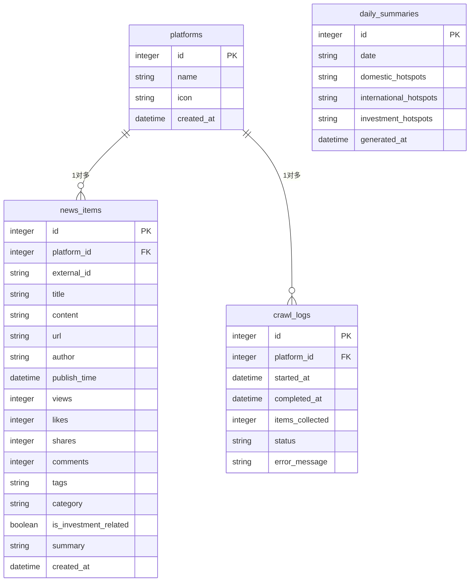

# 数据库设计文档

## 概述

每日热点新闻聚合系统使用 SQLite 数据库存储平台信息、新闻数据、每日总结和采集日志。数据库模块采用模块化设计，支持数据迁移、备份恢复、性能监控和优化。

## 数据库版本

当前版本: 1.0.0
最后更新: 2026-01-29

## 表结构

### 1. platforms 表 - 平台信息

存储支持的新闻来源平台信息。

| 字段名 | 类型 | 可空 | 默认值 | 主键 | 说明 |
|--------|------|------|--------|------|------|
| id | INTEGER | 否 | - | 是 | 平台ID，自增主键 |
| name | TEXT | 否 | - | 否 | 平台名称（Twitter、YouTube、TikTok、Weibo、Douyin） |
| icon | TEXT | 是 | NULL | 否 | 平台图标URL或路径 |
| created_at | DATETIME | 否 | CURRENT_TIMESTAMP | 否 | 创建时间 |

**索引:**
- 主键索引: `platforms_pkey` (id)
- 唯一索引: `platforms_name_unique` (name)

### 2. news_items 表 - 新闻数据

存储从各平台收集的新闻热点数据。

| 字段名 | 类型 | 可空 | 默认值 | 主键 | 说明 |
|--------|------|------|--------|------|------|
| id | INTEGER | 否 | - | 是 | 新闻ID，自增主键 |
| platform_id | INTEGER | 否 | - | 否 | 平台ID，外键引用platforms(id) |
| external_id | TEXT | 否 | - | 否 | 平台原始ID |
| title | TEXT | 否 | - | 否 | 新闻标题 |
| content | TEXT | 否 | - | 否 | 新闻内容（原始内容或摘要） |
| url | TEXT | 否 | - | 否 | 新闻源链接 |
| author | TEXT | 是 | NULL | 否 | 作者/发布者 |
| publish_time | DATETIME | 否 | - | 否 | 发布时间 |
| views | INTEGER | 否 | 0 | 否 | 浏览量 |
| likes | INTEGER | 否 | 0 | 否 | 点赞数 |
| shares | INTEGER | 否 | 0 | 否 | 分享数 |
| comments | INTEGER | 否 | 0 | 否 | 评论数 |
| tags | TEXT | 是 | NULL | 否 | 标签数组，JSON格式 |
| category | TEXT | 是 | NULL | 否 | 分类 |
| is_investment_related | BOOLEAN | 否 | false | 否 | 是否与投资相关 |
| summary | TEXT | 是 | NULL | 否 | AI生成摘要 |
| created_at | DATETIME | 否 | CURRENT_TIMESTAMP | 否 | 创建时间 |

**索引:**
- 主键索引: `news_items_pkey` (id)
- 外键索引: `idx_news_items_platform_id` (platform_id)
- 时间索引: `idx_news_items_publish_time` (publish_time DESC)
- 分类索引: `idx_news_items_category` (category)
- 投资标记索引: `idx_news_items_is_investment_related` (is_investment_related)
- 平台日期复合索引: `idx_news_items_platform_date` (platform_id, DATE(publish_time))
- 唯一约束: `news_items_platform_external_unique` (platform_id, external_id)

### 3. daily_summaries 表 - 每日总结

存储每日热点新闻的AI生成总结。

| 字段名 | 类型 | 可空 | 默认值 | 主键 | 说明 |
|--------|------|------|--------|------|------|
| id | INTEGER | 否 | - | 是 | 总结ID，自增主键 |
| date | TEXT | 否 | - | 否 | 日期，YYYY-MM-DD格式 |
| domestic_hotspots | TEXT | 是 | NULL | 否 | 国内热点数组，JSON格式 |
| international_hotspots | TEXT | 是 | NULL | 否 | 国际热点数组，JSON格式 |
| investment_hotspots | TEXT | 是 | NULL | 否 | 投资热点数组，JSON格式 |
| generated_at | DATETIME | 否 | CURRENT_TIMESTAMP | 否 | 生成时间 |

**索引:**
- 主键索引: `daily_summaries_pkey` (id)
- 日期索引: `idx_daily_summaries_date` (date) - 唯一索引

### 4. crawl_logs 表 - 采集日志

存储各平台数据采集的执行日志。

| 字段名 | 类型 | 可空 | 默认值 | 主键 | 说明 |
|--------|------|------|--------|------|------|
| id | INTEGER | 否 | - | 是 | 日志ID，自增主键 |
| platform_id | INTEGER | 否 | - | 否 | 平台ID，外键引用platforms(id) |
| started_at | DATETIME | 否 | CURRENT_TIMESTAMP | 否 | 开始时间 |
| completed_at | DATETIME | 是 | NULL | 否 | 完成时间 |
| items_collected | INTEGER | 否 | 0 | 否 | 采集的项目数 |
| status | TEXT | 否 | 'running' | 否 | 状态：running, completed, failed |
| error_message | TEXT | 是 | NULL | 否 | 错误信息 |

**索引:**
- 主键索引: `crawl_logs_pkey` (id)
- 外键索引: `idx_crawl_logs_platform_id` (platform_id)
- 状态索引: `idx_crawl_logs_status` (status)
- 时间索引: `idx_crawl_logs_started_at` (started_at DESC)

## 外键关系

## 数据类型说明

### JSON 字段
- `news_items.tags`: 字符串数组，存储新闻标签
- `daily_summaries.domestic_hotspots`: 字符串数组，存储国内热点
- `daily_summaries.international_hotspots`: 字符串数组，存储国际热点
- `daily_summaries.investment_hotspots`: 字符串数组，存储投资热点

### 布尔字段
使用 SQLite 的 INTEGER 类型存储布尔值：
- 0 = false
- 1 = true

### 时间字段
所有时间字段使用 ISO 8601 格式（YYYY-MM-DD HH:MM:SS）存储。

## 数据完整性约束

### 主键约束
所有表都有自增主键，确保每条记录的唯一性。

### 外键约束
- `news_items.platform_id` 引用 `platforms.id`
- `crawl_logs.platform_id` 引用 `platforms.id`

### 唯一约束
- `platforms.name`: 平台名称必须唯一
- `news_items.platform_id + external_id`: 同一平台的原始ID必须唯一
- `daily_summaries.date`: 每日总结日期必须唯一

### 检查约束
- `crawl_logs.status`: 必须是 'running', 'completed', 'failed' 之一
- `news_items.views`, `likes`, `shares`, `comments`: 必须 >= 0

## 性能优化设计

### 索引策略
1. **查询优化索引**: 针对常见查询模式创建索引
2. **外键索引**: 所有外键字段都有索引
3. **复合索引**: 针对联合查询创建复合索引
4. **覆盖索引**: 针对频繁查询创建覆盖索引

### 分区策略
由于新闻数据可能快速增长，考虑按时间分区：
- 按月份分区 `news_items` 表（未来扩展）
- 按平台分区 `crawl_logs` 表（未来扩展）

### 数据归档
- 超过30天的 `news_items` 数据可归档到历史表
- 超过90天的 `crawl_logs` 数据可清理

## 扩展性考虑

### 未来可能添加的表
1. **user_preferences** - 用户偏好设置
2. **news_categories** - 新闻分类系统
3. **trend_analysis** - 趋势分析结果
4. **alert_rules** - 告警规则

### 字段扩展
所有表都预留了扩展字段空间，可以通过数据迁移系统添加新字段。

## 数据库配置

### 连接配置
- 最大连接数: 10（可配置）
- 连接超时: 5000ms（可配置）
- 数据库文件路径: `./data/everyday_news.db`（可配置）

### 性能配置
- 查询缓存: 启用
- 索引监控: 启用
- 自动优化: 启用

## 迁移策略

数据库使用版本化迁移系统，支持：
1. 版本升级和降级
2. 数据转换
3. 回滚机制
4. 迁移验证

## 备份策略

### 自动备份
- 频率: 每日一次
- 保留: 最近7天
- 压缩: 启用
- 加密: 可选

### 手动备份
支持随时手动备份，备份文件包含时间戳和版本信息。

## 监控指标

### 性能监控
- 查询执行时间
- 连接池使用率
- 索引使用效率
- 数据库文件大小

### 告警阈值
- 慢查询: > 1000ms
- 连接池使用率: > 80%
- 数据库大小: > 1GB

---

*本文档最后更新于 2026-01-29*
*数据库版本: 1.0.0*