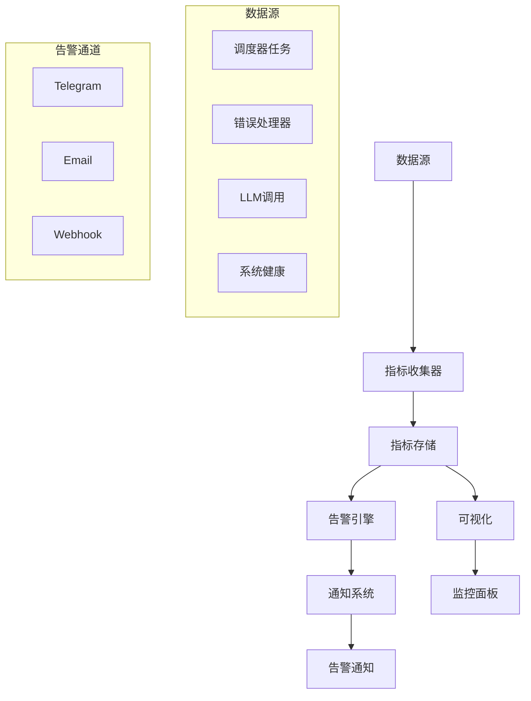

# 监控与告警配置指南

## 监控系统概述

系统架构模块内置了全面的监控和告警系统，用于跟踪系统性能、业务指标和错误率。监控系统基于指标收集、聚合和告警触发机制构建。

## 监控架构



## 监控配置

### 基础配置

#### 环境变量配置
```bash
# 监控基础配置
MONITORING_ENABLED=true
MONITORING_COLLECTION_INTERVAL=60000        # 收集间隔（毫秒）
MONITORING_RETENTION_PERIOD=604800000       # 数据保留期（7天，毫秒）
MONITORING_MAX_METRICS=100000               # 最大指标数量

# 存储配置
MONITORING_STORAGE_TYPE=sqlite              # 存储类型：sqlite, memory
MONITORING_SQLITE_PATH=./data/metrics.db    # SQLite数据库路径

# 性能配置
MONITORING_BUFFER_SIZE=1000                 # 内存缓冲区大小
MONITORING_BATCH_SIZE=100                   # 批量写入大小
```

#### 配置文件 (`config/monitoring.yaml`)
```yaml
# 监控系统全局配置
monitoring:
  # 收集配置
  collectionInterval: 60000          # 收集间隔（毫秒）
  retentionPeriod: 604800000         # 保留期（7天，毫秒）
  maxMetrics: 100000                 # 最大指标数

  # 存储配置
  storage:
    type: sqlite                     # 存储类型：sqlite, memory
    sqlite:
      path: ./data/metrics.db        # 数据库路径
      maxConnections: 5              # 最大连接数
      timeout: 5000                  # 超时时间（毫秒）

  # 性能配置
  performance:
    bufferSize: 1000                 # 内存缓冲区大小
    batchSize: 100                   # 批量写入大小
    flushInterval: 5000              # 刷新间隔（毫秒）

  # 健康检查配置
  healthChecks:
    database: true                   # 数据库健康检查
    scheduler: true                  # 调度器健康检查
    notification: true               # 通知系统健康检查
    claude: true                     # Claude集成健康检查
    interval: 30000                  # 健康检查间隔（毫秒）

  # 指标收集器配置
  collectors:
    system:
      enabled: true                  # 系统指标收集器
      interval: 60000                # 收集间隔
      metrics:
        - memory_usage               # 内存使用率
        - cpu_usage                  # CPU使用率
        - disk_usage                 # 磁盘使用率
        - process_count              # 进程数

    scheduler:
      enabled: true                  # 调度器指标收集器
      interval: 30000                # 收集间隔
      metrics:
        - task_execution_time        # 任务执行时间
        - task_success_rate          # 任务成功率
        - concurrent_tasks           # 并发任务数
        - queue_size                 # 队列大小

    error:
      enabled: true                  # 错误指标收集器
      interval: 60000                # 收集间隔
      metrics:
        - error_count                # 错误计数
        - error_rate                 # 错误率
        - retry_count                # 重试计数
        - degradation_count          # 降级计数
```

### 指标定义

#### 系统指标
| 指标名称 | 类型 | 单位 | 描述 | 标签 |
|----------|------|------|------|------|
| `system_memory_usage` | gauge | 百分比 | 内存使用率 | `type` (total, used, free, cache) |
| `system_cpu_usage` | gauge | 百分比 | CPU使用率 | `core` (0, 1, ...), `mode` (user, system, idle) |
| `system_disk_usage` | gauge | 百分比 | 磁盘使用率 | `mount` (挂载点), `type` (total, used, free) |
| `system_process_count` | gauge | 个 | 进程数量 | `state` (running, sleeping, stopped, zombie) |
| `system_uptime` | counter | 秒 | 系统运行时间 | - |
| `system_load_average` | gauge | - | 系统负载 | `period` (1min, 5min, 15min) |

#### 调度器指标
| 指标名称 | 类型 | 单位 | 描述 | 标签 |
|----------|------|------|------|------|
| `scheduler_task_execution_time` | histogram | 毫秒 | 任务执行时间分布 | `task_id`, `task_name`, `status` (success, failed) |
| `scheduler_task_success_rate` | gauge | 百分比 | 任务成功率 | `task_id`, `task_name`, `period` (1h, 24h, 7d) |
| `scheduler_concurrent_tasks` | gauge | 个 | 并发任务数 | - |
| `scheduler_queue_size` | gauge | 个 | 队列大小 | - |
| `scheduler_task_total` | counter | 个 | 总任务执行次数 | `task_id`, `task_name`, `status` |
| `scheduler_task_retries` | counter | 个 | 任务重试次数 | `task_id`, `task_name` |

#### 错误处理指标
| 指标名称 | 类型 | 单位 | 描述 | 标签 |
|----------|------|------|------|------|
| `error_total` | counter | 个 | 总错误数 | `type` (collection, database, llm, system), `handler` |
| `error_rate` | gauge | 百分比 | 错误率 | `type`, `period` (1h, 24h) |
| `retry_total` | counter | 个 | 总重试次数 | `type`, `handler`, `attempt` (1, 2, 3) |
| `degradation_total` | counter | 个 | 总降级次数 | `type`, `handler`, `degradation_type` |
| `error_duration` | histogram | 毫秒 | 错误处理时间 | `type`, `handler`, `status` (resolved, degraded, failed) |

#### LLM集成指标
| 指标名称 | 类型 | 单位 | 描述 | 标签 |
|----------|------|------|------|------|
| `llm_call_total` | counter | 个 | LLM调用总数 | `model`, `template`, `status` (success, failed) |
| `llm_token_usage` | counter | 个 | Token使用总数 | `model`, `template`, `type` (input, output) |
| `llm_response_time` | histogram | 毫秒 | LLM响应时间 | `model`, `template`, `status` |
| `llm_cache_hit_rate` | gauge | 百分比 | 缓存命中率 | `model`, `template`, `period` |
| `llm_cost_estimated` | counter | 美元 | 估计成本 | `model`, `period` (hourly, daily, monthly) |

#### 通知系统指标
| 指标名称 | 类型 | 单位 | 描述 | 标签 |
|----------|------|------|------|------|
| `notification_send_total` | counter | 个 | 通知发送总数 | `channel`, `priority`, `status` (success, failed) |
| `notification_success_rate` | gauge | 百分比 | 通知成功率 | `channel`, `priority`, `period` |
| `notification_delivery_time` | histogram | 毫秒 | 通知送达时间 | `channel`, `priority`, `status` |
| `notification_queue_size` | gauge | 个 | 通知队列大小 | `channel`, `priority` |

### 指标收集配置

#### 自定义指标收集
```typescript
import { metricsCollector } from '../src/system/monitoring';

// 定义自定义指标
metricsCollector.defineMetric('business_news_count', {
  type: 'gauge',
  description: '业务相关新闻数量',
  unit: '个',
  labels: ['platform', 'category'],
  aggregation: 'sum'
});

// 收集自定义指标
metricsCollector.record({
  name: 'business_news_count',
  value: 150,
  tags: { platform: 'twitter', category: 'investment' }
});

// 批量收集
metricsCollector.recordBatch([
  {
    name: 'business_news_count',
    value: 150,
    tags: { platform: 'twitter', category: 'investment' }
  },
  {
    name: 'business_news_count',
    value: 80,
    tags: { platform: 'youtube', category: 'investment' }
  }
]);
```

#### 指标聚合配置
```yaml
# 指标聚合配置
aggregations:
  # 按时间窗口聚合
  timeWindows:
    - name: '1m'     # 1分钟聚合
      interval: 60000
      retain: 3600000  # 保留1小时

    - name: '5m'     # 5分钟聚合
      interval: 300000
      retain: 86400000  # 保留24小时

    - name: '1h'     # 1小时聚合
      interval: 3600000
      retain: 604800000  # 保留7天

    - name: '1d'     # 1天聚合
      interval: 86400000
      retain: 2592000000  # 保留30天

  # 聚合函数配置
  functions:
    - name: 'avg'    # 平均值
      enabled: true

    - name: 'sum'    # 求和
      enabled: true

    - name: 'min'    # 最小值
      enabled: true

    - name: 'max'    # 最大值
      enabled: true

    - name: 'count'  # 计数
      enabled: true

    - name: 'p95'    # 95分位数
      enabled: true
      percentiles: [0.95]

    - name: 'p99'    # 99分位数
      enabled: true
      percentiles: [0.99]
```

## 告警配置

### 告警规则定义

#### 配置文件 (`config/alerts.yaml`)
```yaml
# 告警规则配置
alerts:
  # 调度器告警
  scheduler:
    # 任务失败告警
    task_failure_rate:
      name: '任务失败率过高'
      description: '当任务失败率超过阈值时触发告警'
      enabled: true
      severity: 'warning'           # 严重级别：info, warning, error, critical

      # 指标配置
      metric: 'scheduler_task_success_rate'
      condition: '<'                 # 条件：<, <=, >, >=, ==, !=
      threshold: 80                  # 阈值：80%成功率

      # 时间窗口配置
      window: '5m'                  # 时间窗口：5分钟
      evaluationInterval: '1m'      # 评估间隔：1分钟

      # 触发条件
      trigger:
        type: 'threshold'           # 触发类型：threshold, change, anomaly
        duration: '2m'              # 持续时长：连续2分钟超过阈值
        cooldown: '30m'             # 冷却时间：30分钟

      # 标签过滤
      filters:
        task_id: '*'                # 所有任务
        # 或指定特定任务
        # task_id: ['twitter-collection', 'youtube-collection']

      # 通知配置
      notifications:
        - channel: 'telegram'
          template: 'task_failure_alert'
          priority: 'high'

        - channel: 'email'
          template: 'task_failure_alert_email'
          priority: 'medium'

        - channel: 'webhook'
          template: 'task_failure_alert_webhook'
          priority: 'low'

    # 任务执行时间过长告警
    task_execution_timeout:
      name: '任务执行超时'
      description: '当任务执行时间超过阈值时触发告警'
      enabled: true
      severity: 'error'

      metric: 'scheduler_task_execution_time'
      condition: '>'
      threshold: 300000              # 5分钟（300000毫秒）

      window: '10m'
      evaluationInterval: '2m'

      trigger:
        type: 'threshold'
        duration: '1m'
        cooldown: '15m'

      filters:
        status: 'running'

      notifications:
        - channel: 'telegram'
          template: 'task_timeout_alert'
          priority: 'critical'

  # 错误率告警
  error:
    # 系统错误率告警
    system_error_rate:
      name: '系统错误率过高'
      description: '当系统错误率超过阈值时触发告警'
      enabled: true
      severity: 'critical'

      metric: 'error_rate'
      condition: '>'
      threshold: 10                  # 10%错误率

      window: '5m'
      evaluationInterval: '1m'

      trigger:
        type: 'threshold'
        duration: '3m'              # 连续3分钟超过阈值
        cooldown: '1h'

      filters:
        type: 'system'

      notifications:
        - channel: 'telegram'
          template: 'system_error_alert'
          priority: 'critical'

        - channel: 'email'
          template: 'system_error_alert_email'
          priority: 'critical'

    # LLM调用失败告警
    llm_failure_rate:
      name: 'LLM调用失败率过高'
      description: '当LLM调用失败率超过阈值时触发告警'
      enabled: true
      severity: 'error'

      metric: 'llm_call_total'
      condition: 'status == failed and rate > 20%'  # 复合条件

      window: '10m'
      evaluationInterval: '2m'

      trigger:
        type: 'threshold'
        duration: '2m'
        cooldown: '30m'

      filters:
        model: '*'

      notifications:
        - channel: 'telegram'
          template: 'llm_failure_alert'
          priority: 'high'

  # 资源使用告警
  resources:
    # 内存使用率告警
    memory_usage:
      name: '内存使用率过高'
      description: '当内存使用率超过阈值时触发告警'
      enabled: true
      severity: 'warning'

      metric: 'system_memory_usage'
      condition: '>'
      threshold: 80                 # 80%内存使用率

      window: '5m'
      evaluationInterval: '1m'

      trigger:
        type: 'threshold'
        duration: '5m'              # 连续5分钟超过阈值
        cooldown: '15m'

      filters:
        type: 'used'

      notifications:
        - channel: 'telegram'
          template: 'memory_alert'
          priority: 'high'

    # 磁盘空间告警
    disk_usage:
      name: '磁盘空间不足'
      description: '当磁盘使用率超过阈值时触发告警'
      enabled: true
      severity: 'critical'

      metric: 'system_disk_usage'
      condition: '>'
      threshold: 90                 # 90%磁盘使用率

      window: '10m'
      evaluationInterval: '2m'

      trigger:
        type: 'threshold'
        duration: '1m'
        cooldown: '1h'

      filters:
        type: 'used'
        mount: '/'                  # 根分区

      notifications:
        - channel: 'telegram'
          template: 'disk_alert'
          priority: 'critical'

        - channel: 'email'
          template: 'disk_alert_email'
          priority: 'critical'

  # 业务指标告警
  business:
    # 新闻采集数量下降告警
    news_collection_drop:
      name: '新闻采集数量下降'
      description: '当新闻采集数量显著下降时触发告警'
      enabled: true
      severity: 'warning'

      metric: 'news_collection_count'
      condition: 'decrease > 50% over 1h'  # 1小时内下降超过50%

      window: '1h'
      evaluationInterval: '10m'

      trigger:
        type: 'change'              # 变化检测
        duration: '20m'
        cooldown: '2h'

      filters:
        platform: '*'

      notifications:
        - channel: 'telegram'
          template: 'collection_drop_alert'
          priority: 'medium'

    # 总结生成失败告警
    summary_generation_failure:
      name: '每日总结生成失败'
      description: '当日总结生成失败时触发告警'
      enabled: true
      severity: 'error'

      metric: 'daily_summary_generated'
      condition: '== 0 between 02:00 and 04:00'  # 凌晨2-4点间未生成

      window: '2h'
      evaluationInterval: '30m'

      trigger:
        type: 'threshold'
        duration: '30m'
        cooldown: '6h'

      notifications:
        - channel: 'telegram'
          template: 'summary_failure_alert'
          priority: 'high'

        - channel: 'email'
          template: 'summary_failure_alert_email'
          priority: 'high'
```

### 告警模板

#### Telegram告警模板
```yaml
templates:
  telegram:
    task_failure_alert: |
      🚨 *任务失败告警*

      *告警名称*: {alert_name}
      *严重级别*: {severity}
      *触发时间*: {trigger_time}

      *指标详情*:
      - 指标: {metric}
      - 当前值: {current_value}%
      - 阈值: {threshold}%
      - 任务ID: {task_id}
      - 任务名称: {task_name}

      *建议操作*:
      1. 检查任务日志
      2. 验证任务配置
      3. 查看相关服务状态

      *告警ID*: {alert_id}

    system_error_alert: |
      🔴 *系统错误告警*

      *告警名称*: {alert_name}
      *严重级别*: {severity}
      *触发时间*: {trigger_time}

      *错误详情*:
      - 错误类型: {error_type}
      - 错误率: {error_rate}%
      - 错误计数: {error_count}
      - 时间段: {period}

      *最近错误*:
      {recent_errors}

      *紧急程度*: 需要立即处理

      *告警ID*: {alert_id}

    memory_alert: |
      ⚠️ *内存使用告警*

      *告警名称*: {alert_name}
      *严重级别*: {severity}
      *触发时间*: {trigger_time}

      *资源详情*:
      - 内存使用率: {memory_usage}%
      - 总内存: {total_memory} GB
      - 已使用: {used_memory} GB
      - 可用内存: {free_memory} GB

      *系统信息*:
      - 主机: {hostname}
      - 时间: {timestamp}
      - 运行时长: {uptime}

      *建议操作*:
      1. 检查内存泄漏
      2. 重启相关服务
      3. 增加系统内存

      *告警ID*: {alert_id}

    disk_alert: |
      🔥 *磁盘空间告警*

      *告警名称*: {alert_name}
      *严重级别*: {severity}
      *触发时间*: {trigger_time}

      *磁盘详情*:
      - 磁盘使用率: {disk_usage}%
      - 总空间: {total_space} GB
      - 已使用: {used_space} GB
      - 可用空间: {free_space} GB
      - 挂载点: {mount_point}

      *紧急程度*: 需要立即处理

      *建议操作*:
      1. 清理日志文件
      2. 删除临时文件
      3. 备份并清理旧数据
      4. 考虑扩容磁盘

      *告警ID*: {alert_id}
```

#### Email告警模板
```yaml
email:
  task_failure_alert_email: |
    主题: [告警] {alert_name} - {severity}

    告警详情:
    ==========

    告警信息:
    ----------
    • 告警名称: {alert_name}
    • 严重级别: {severity}
    • 触发时间: {trigger_time}
    • 告警ID: {alert_id}

    指标信息:
    ----------
    • 指标名称: {metric}
    • 当前值: {current_value}%
    • 阈值: {threshold}%
    • 任务ID: {task_id}
    • 任务名称: {task_name}
    • 时间窗口: {window}

    任务状态:
    ----------
    最近5次执行状态:
    {recent_task_executions}

    建议操作:
    ----------
    1. 查看任务详细日志: {task_log_url}
    2. 检查任务依赖服务状态
    3. 验证任务配置参数
    4. 如有需要，手动执行任务测试

    系统信息:
    ----------
    • 主机: {hostname}
    • 环境: {environment}
    • 发送时间: {send_time}

  system_error_alert_email: |
    主题: [紧急告警] {alert_name} - {severity}

    告警详情:
    ==========

    紧急告警 - 需要立即处理！

    错误概况:
    ----------
    • 错误类型: {error_type}
    • 错误率: {error_rate}%
    • 错误计数: {error_count}
    • 时间段: {period}
    • 首次发生: {first_occurrence}
    • 最后发生: {last_occurrence}

    错误详情:
    ----------
    最近10个错误:
    {recent_errors_details}

    影响分析:
    ----------
    • 受影响的组件: {affected_components}
    • 用户影响: {user_impact}
    • 业务影响: {business_impact}

    紧急处理步骤:
    ----------
    1. 立即登录系统检查
    2. 查看详细错误日志
    3. 评估是否需要回滚
    4. 通知相关人员

    联系人:
    ----------
    • 系统管理员: {admin_contact}
    • 技术支持: {support_contact}
    • 值班人员: {oncall_contact}
```

#### Webhook告警模板
```yaml
webhook:
  task_failure_alert_webhook:
    # Webhook使用JSON格式，直接传递数据结构
    format: json
    schema:
      type: object
      properties:
        alert:
          type: object
          properties:
            id: { type: string }
            name: { type: string }
            severity: { type: string }
            status: { type: string }
            triggeredAt: { type: string }

        metric:
          type: object
          properties:
            name: { type: string }
            value: { type: number }
            threshold: { type: number }
            unit: { type: string }

        task:
          type: object
          properties:
            id: { type: string }
            name: { type: string }
            description: { type: string }

        system:
          type: object
          properties:
            hostname: { type: string }
            environment: { type: string }
            timestamp: { type: string }

        actions:
          type: array
          items: { type: string }
```

### 告警管理API

#### 告警规则管理
```typescript
import { metricsCollector } from '../src/system/monitoring';

// 创建告警规则
const alertId = await metricsCollector.createAlert({
  name: '自定义告警',
  metric: 'custom_metric',
  condition: '>',
  threshold: 90,
  window: '5m',
  severity: 'warning',
  notifications: [
    {
      channel: 'telegram',
      template: 'custom_alert',
      priority: 'high'
    }
  ]
});

// 启用/禁用告警
await metricsCollector.enableAlert(alertId, true);

// 更新告警规则
await metricsCollector.updateAlert(alertId, {
  threshold: 95,
  severity: 'error'
});

// 删除告警规则
await metricsCollector.deleteAlert(alertId);

// 获取告警规则列表
const alerts = await metricsCollector.getAlerts();
```

#### 告警状态查询
```typescript
// 查询活跃告警
const activeAlerts = await metricsCollector.getActiveAlerts();

// 查询告警历史
const alertHistory = await metricsCollector.getAlertHistory({
  startTime: '2026-01-01T00:00:00Z',
  endTime: '2026-01-31T23:59:59Z',
  severity: ['error', 'critical'],
  limit: 50
});

// 告警统计
const alertStats = await metricsCollector.getAlertStats({
  period: '24h',
  groupBy: 'severity'
});

console.log('告警统计:', alertStats);
/*
{
  total: 42,
  bySeverity: {
    critical: 5,
    error: 12,
    warning: 20,
    info: 5
  },
  byStatus: {
    active: 3,
    resolved: 39
  }
}
*/
```

#### 告警静默管理
```typescript
// 创建告警静默
const silenceId = await metricsCollector.createSilence({
  alertId: 'task_failure_rate',
  reason: '计划维护',
  startTime: '2026-01-30T02:00:00Z',
  endTime: '2026-01-30T04:00:00Z',
  createdBy: 'admin@example.com',
  comment: '系统维护期间，暂停相关告警'
});

// 提前结束静默
await metricsCollector.endSilence(silenceId);

// 查询静默规则
const silences = await metricsCollector.getSilences({
  activeOnly: true
});
```

## 监控集成

### Prometheus集成

#### 配置导出
```yaml
# Prometheus导出配置
prometheus:
  enabled: true
  port: 9091                      # 暴露端口
  path: '/metrics'                # 指标路径
  collectInterval: 15000          # 收集间隔（毫秒）

  # 指标映射配置
  metricMappings:
    system_memory_usage: 'system_memory_usage_percent'
    system_cpu_usage: 'system_cpu_usage_percent'
    scheduler_task_total: 'scheduler_task_executions_total'
    error_total: 'errors_total'

  # 标签映射
  labelMappings:
    task_id: 'task'
    platform: 'source'
    type: 'error_type'

  # Prometheus远程写入（可选）
  remoteWrite:
    enabled: false
    url: 'http://prometheus:9090/api/v1/write'
    basicAuth:
      username: '${PROMETHEUS_USER}'
      password: '${PROMETHEUS_PASSWORD}'
```

#### Prometheus抓取配置
```yaml
# prometheus.yml 配置示例
scrape_configs:
  - job_name: 'everyday-news'
    static_configs:
      - targets: ['everyday-news-app:9091']
    scrape_interval: 15s
    scrape_timeout: 10s

    # 标签
    labels:
      environment: 'production'
      application: 'everyday-news'
      team: 'platform'

    # 指标重命名
    metric_relabel_configs:
      - source_labels: [__name__]
        regex: 'system_memory_usage'
        replacement: 'app_memory_usage'
        action: replace
```

### Grafana集成

#### 数据源配置
```yaml
# Grafana数据源配置 (config/grafana/datasources/datasource.yml)
apiVersion: 1

datasources:
  - name: 'Everyday-News'
    type: 'prometheus'
    access: 'proxy'
    url: 'http://prometheus:9090'
    isDefault: true

    jsonData:
      timeInterval: '15s'
      queryTimeout: '60s'
      httpMethod: 'POST'

    secureJsonData:
      # 如果有认证
      # basicAuthPassword: '${GRAFANA_PROMETHEUS_PASSWORD}'
```

#### 仪表板配置
```yaml
# Grafana仪表板配置 (config/grafana/dashboards/dashboard.yml)
apiVersion: 1

providers:
  - name: 'Everyday-News Dashboards'
    orgId: 1
    folder: 'Everyday-News'
    type: 'file'
    disableDeletion: false
    editable: true
    options:
      path: /etc/grafana/provisioning/dashboards
```

#### 预定义仪表板
系统包含以下预定义仪表板:
1. **系统概览** - 核心系统指标和健康状态
2. **调度器监控** - 任务执行状态和性能
3. **错误分析** - 错误率和趋势分析
4. **LLM集成** - Claude API使用和成本
5. **通知系统** - 通知发送状态和成功率
6. **资源监控** - 系统资源使用情况
7. **业务指标** - 新闻采集和总结生成数据

### 外部监控系统集成

#### 发送到外部系统
```typescript
import { metricsCollector } from '../src/system/monitoring';

// 配置外部监控系统
metricsCollector.configureExternalSystem({
  name: 'datadog',
  type: 'datadog',
  enabled: true,

  config: {
    apiKey: process.env.DATADOG_API_KEY,
    site: 'datadoghq.com',
    timeout: 10000
  },

  // 指标过滤
  filters: {
    include: ['system_.*', 'scheduler_.*', 'error_.*'],
    exclude: ['.*debug.*']
  },

  // 标签映射
  tags: {
    environment: process.env.NODE_ENV,
    version: process.env.APP_VERSION,
    region: process.env.REGION
  }
});

// 手动推送指标
await metricsCollector.pushToExternalSystem('datadog', {
  metrics: recentMetrics,
  timestamp: new Date()
});
```

#### 支持的第三方系统
- **Datadog**: 全面的监控和分析平台
- **New Relic**: 应用性能监控
- **AWS CloudWatch**: AWS云监控服务
- **Azure Monitor**: Azure云监控服务
- **Google Cloud Monitoring**: GCP监控服务
- **Elasticsearch**: 日志和指标分析
- **InfluxDB**: 时间序列数据库

## 监控最佳实践

### 1. 指标设计原则
- **业务导向**: 监控指标应与业务目标对齐
- **可操作性**: 指标应能指导具体的操作和决策
- **层次化**: 从基础设施到应用层到业务层
- **标准化**: 使用一致的命名和标签规范

### 2. 告警设计原则
- **相关性**: 只对重要问题告警
- **可行动性**: 告警应包含明确的处理步骤
- **适当分级**: 根据影响程度设置不同严重级别
- **避免告警疲劳**: 合理设置阈值和静默规则

### 3. 性能优化
- **采样频率**: 根据指标重要性设置不同的收集频率
- **数据聚合**: 使用合适的聚合函数减少数据量
- **存储优化**: 定期清理旧数据，使用压缩存储
- **查询优化**: 为常用查询创建索引和预聚合

### 4. 安全性考虑
- **访问控制**: 限制监控数据的访问权限
- **数据脱敏**: 避免在监控数据中包含敏感信息
- **传输加密**: 使用TLS加密监控数据传输
- **审计日志**: 记录监控系统的访问和操作

## 故障排除

### 监控系统常见问题

#### 1. 指标收集失败
**症状**: 监控面板显示"No data"或指标不更新
**诊断**:
```bash
# 检查监控服务状态
curl http://localhost:3000/monitoring/status

# 检查收集器日志
docker logs everyday-news-app 2>&1 | grep -i "collector\|metric" | tail -20

# 手动触发指标收集
curl -X POST http://localhost:3000/monitoring/collect/test
```

**解决方案**:
1. 检查监控服务配置
2. 验证指标定义语法
3. 检查存储空间和权限
4. 重启监控服务

#### 2. 告警不触发
**症状**: 指标超过阈值但未触发告警
**诊断**:
```bash
# 检查告警规则状态
curl http://localhost:3000/alerts/rules

# 检查告警评估日志
docker logs everyday-news-app 2>&1 | grep -i "alert\|evaluate" | tail -20

# 测试告警规则
curl -X POST http://localhost:3000/alerts/test \
  -H "Content-Type: application/json" \
  -d '{"ruleId": "task_failure_rate", "testValue": 75}'
```

**解决方案**:
1. 验证告警规则配置
2. 检查时间窗口和评估间隔
3. 确认通知通道配置
4. 检查冷却期设置

#### 3. 监控数据存储问题
**症状**: 指标数据丢失或查询缓慢
**诊断**:
```bash
# 检查数据库状态
docker exec everyday-news-app ls -lh /app/data/metrics.db

# 检查数据库完整性
docker exec everyday-news-app sqlite3 /app/data/metrics.db "PRAGMA integrity_check;"

# 查询数据统计
curl http://localhost:3000/metrics/stats
```

**解决方案**:
1. 清理旧数据: `curl -X POST http://localhost:3000/metrics/cleanup`
2. 优化数据库: `curl -X POST http://localhost:3000/metrics/optimize`
3. 增加存储空间
4. 调整数据保留策略

#### 4. 集成问题
**症状**: 外部监控系统接收不到数据
**诊断**:
```bash
# 检查集成配置
curl http://localhost:3000/monitoring/externals

# 测试外部系统连接
curl -X POST http://localhost:3000/monitoring/externals/test \
  -H "Content-Type: application/json" \
  -d '{"system": "datadog"}'

# 查看集成日志
docker logs everyday-news-app 2>&1 | grep -i "external\|push" | tail -20
```

**解决方案**:
1. 验证API密钥和配置
2. 检查网络连接和防火墙
3. 查看外部系统配额限制
4. 调整推送频率和批量大小

## 监控配置验证清单

### 配置前检查
- [ ] 明确监控目标和业务需求
- [ ] 识别关键业务指标(KPIs)
- [ ] 确定告警阈值和严重级别
- [ ] 设计通知流程和升级策略

### 配置中检查
- [ ] 验证指标定义语法正确
- [ ] 测试告警规则触发条件
- [ ] 确认通知模板格式正确
- [ ] 验证外部集成连接正常

### 配置后检查
- [ ] 监控指标数据正常收集
- [ ] 告警规则按预期触发
- [ ] 通知消息正确发送
- [ ] 监控面板数据显示正常
- [ ] 性能影响在可接受范围

### 定期维护检查
- [ ] 审查和优化告警阈值
- [ ] 清理过期监控数据
- [ ] 更新监控仪表板
- [ ] 测试灾难恢复流程
- [ ] 评估监控系统性能

---

*本文档最后更新于 2026-01-30*
*监控告警配置版本: 1.0.0*

更多信息请参考:
- [配置指南](./configuration.md)
- [运维指南](./operations.md)
- [系统API文档](./system-api.md)