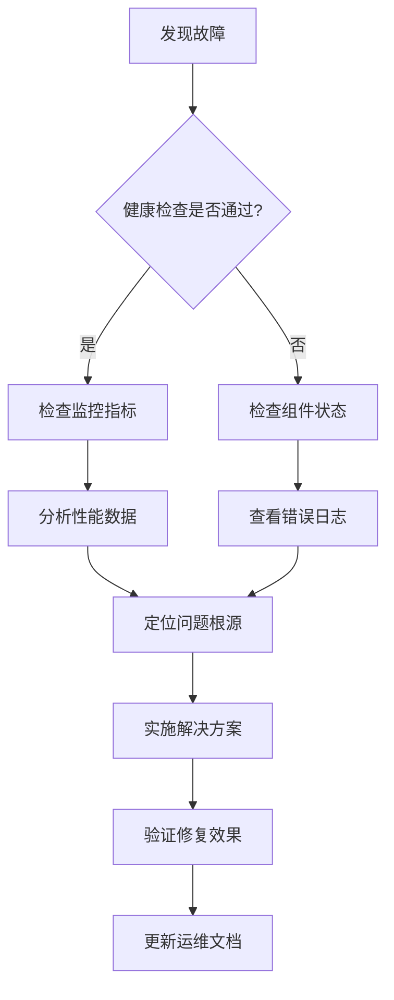

# 每日热点新闻聚合系统 - 运维与故障排除指南

## 运维概览

本文档提供系统日常运维、监控、故障排除和恢复的完整指南。适用于系统管理员和运维工程师。

## 日常运维任务

### 1. 系统状态监控

#### 健康检查
```bash
# 使用部署脚本检查状态
./scripts/deploy.sh prod status

# 或直接调用健康检查API
curl -s http://localhost:3000/health | jq .

# 期望响应示例
{
  "healthy": true,
  "components": {
    "scheduler": { "healthy": true, "message": "3 tasks scheduled" },
    "notification": { "healthy": true, "message": "Available adapters: telegram, email" },
    "monitoring": { "healthy": true, "message": "Recent activity: true" },
    "claude": { "healthy": true, "message": "5 LLM calls recorded" }
  }
}
```

#### 服务状态检查
```bash
# 检查Docker容器状态
docker ps --filter "name=everyday-news"

# 检查容器日志
docker logs everyday-news-app --tail 100

# 检查资源使用情况
docker stats everyday-news-app --no-stream

# 检查磁盘空间
df -h /path/to/data
```

#### 监控指标检查
```bash
# 访问监控面板 (如果启用了Grafana)
# 地址: http://localhost:3001
# 默认用户名/密码: admin/admin

# 或直接查询监控API
curl http://localhost:3000/metrics/current | jq .
```

### 2. 日志管理

#### 日志位置
- **Docker容器**: `docker logs everyday-news-app`
- **文件日志**: `/app/logs/app.log` (容器内) 或 `./logs/app.log` (宿主机)
- **系统日志**: `/var/log/syslog` 或 `journalctl -u everyday-news`

#### 日志级别配置
```bash
# 临时调整日志级别
export LOG_LEVEL=debug
./scripts/deploy.sh prod restart

# 永久调整 - 编辑环境变量文件
nano .env.prod
# 设置 LOG_LEVEL=debug
```

#### 日志轮转
```bash
# 检查日志文件大小
ls -lh ./logs/

# 手动清理旧日志
find ./logs -name "*.log" -mtime +7 -delete

# 配置logrotate (Linux系统)
sudo nano /etc/logrotate.d/everyday-news
```

logrotate配置示例:
```
/app/logs/*.log {
    daily
    rotate 30
    compress
    delaycompress
    missingok
    notifempty
    create 644 nodejs nodejs
    postrotate
        docker exec everyday-news-app pkill -HUP node
    endscript
}
```

### 3. 备份管理

#### 数据库备份
```bash
# 手动备份数据库
docker exec everyday-news-app npm run db:backup

# 检查备份文件
ls -lh ./data/backups/

# 自动备份状态检查
docker logs everyday-news-backup --tail 50

# 恢复数据库备份
docker exec everyday-news-app npm run db:restore -- backup_file.sqlite3
```

#### 配置文件备份
```bash
# 备份配置文件和密钥
tar -czf config_backup_$(date +%Y%m%d).tar.gz \
  .env.prod \
  config/ \
  scripts/

# 备份到远程存储
scp config_backup_*.tar.gz backup-server:/backups/everyday-news/
```

### 4. 性能监控

#### 关键性能指标
| 指标 | 正常范围 | 检查命令 | 告警阈值 |
|------|----------|----------|----------|
| 内存使用 | < 80% | `docker stats --no-stream` | > 90% |
| CPU使用 | < 70% | `docker stats --no-stream` | > 85% |
| 磁盘空间 | > 20% | `df -h` | < 10% |
| 响应时间 | < 2秒 | `curl -w "%{time_total}"` | > 5秒 |
| 错误率 | < 5% | 监控面板 | > 10% |
| 采集成功率 | > 80% | 监控面板 | < 70% |

#### 性能优化建议
```bash
# 清理临时文件
docker exec everyday-news-app npm run cleanup

# 优化数据库
docker exec everyday-news-app npm run db:optimize

# 重启服务释放内存
./scripts/deploy.sh prod restart
```

### 5. 安全维护

#### 定期更新
```bash
# 更新依赖
npm audit fix
npm update

# 安全漏洞检查
npm audit

# 重建Docker镜像
./scripts/deploy.sh prod build
```

#### 访问控制检查
```bash
# 检查开放的端口
netstat -tlnp | grep :3000

# 检查防火墙规则
sudo ufw status verbose

# 检查SSL证书有效期 (如果使用HTTPS)
openssl s_client -connect your-domain.com:443 2>/dev/null | openssl x509 -noout -dates
```

#### 安全扫描
```bash
# Docker镜像安全扫描 (需安装trivy)
trivy image everyday-news:latest

# 代码安全扫描 (需安装snyk)
npx snyk test
```

## 故障排除

### 故障诊断流程



### 常见故障及解决方案

#### 故障1: 服务无法启动

**症状**:
```
Error: Cannot start container everyday-news-app
Port 3000 is already in use
```

**诊断步骤**:
```bash
# 1. 检查端口占用
sudo lsof -i :3000

# 2. 检查容器状态
docker ps -a | grep everyday-news

# 3. 查看启动日志
docker logs everyday-news-app 2>&1 | tail -50
```

**解决方案**:
```bash
# 方案A: 释放端口
sudo kill -9 $(sudo lsof -t -i:3000)

# 方案B: 更改端口
# 编辑 .env.prod，修改 PORT=3001
# 编辑 docker-compose.yml，修改端口映射

# 方案C: 清理并重新启动
./scripts/deploy.sh prod down
docker system prune -f
./scripts/deploy.sh prod up
```

#### 故障2: 数据库连接失败

**症状**:
```
SQLITE_CANTOPEN: unable to open database file
Error: connect ECONNREFUSED
```

**诊断步骤**:
```bash
# 1. 检查数据库文件权限
ls -la ./data/everyday_news.db

# 2. 检查磁盘空间
df -h .

# 3. 检查文件锁
fuser ./data/everyday_news.db

# 4. 测试数据库连接
docker exec everyday-news-app node -e "
  const Database = require('better-sqlite3');
  try {
    const db = new Database('/app/data/everyday_news.db');
    console.log('Database connection successful');
    db.close();
  } catch (err) {
    console.error('Database connection failed:', err.message);
  }
"
```

**解决方案**:
```bash
# 方案A: 修复权限
sudo chown -R 1001:1001 ./data
sudo chmod 755 ./data
sudo chmod 644 ./data/*.db

# 方案B: 从备份恢复
cp ./data/backups/everyday_news.db.latest ./data/everyday_news.db

# 方案C: 重新初始化数据库
docker exec everyday-news-app npm run db:reset
docker exec everyday-news-app npm run db:init
```

#### 故障3: 调度器任务不执行

**症状**:
- 定时任务没有按计划执行
- 任务状态显示为"pending"或"failed"
- 没有任务执行日志

**诊断步骤**:
```bash
# 1. 检查调度器状态
curl http://localhost:3000/scheduler/status | jq .

# 2. 查看任务列表
curl http://localhost:3000/scheduler/tasks | jq .

# 3. 检查系统时间
docker exec everyday-news-app date
date

# 4. 查看调度器日志
docker logs everyday-news-app 2>&1 | grep -i scheduler | tail -20
```

**解决方案**:
```bash
# 方案A: 重启调度器
curl -X POST http://localhost:3000/scheduler/restart

# 方案B: 手动触发任务测试
curl -X POST http://localhost:3000/scheduler/tasks/twitter-collection/execute

# 方案C: 调整时区设置
# 编辑 .env.prod，添加 TZ=Asia/Shanghai
./scripts/deploy.sh prod restart

# 方案D: 检查cron表达式
# 使用在线工具验证cron表达式: https://crontab.guru
```

#### 故障4: 通知发送失败

**症状**:
- Telegram/Email通知无法发送
- 通知历史记录显示"failed"状态
- 没有错误信息或超时

**诊断步骤**:
```bash
# 1. 检查通知通道可用性
curl http://localhost:3000/notification/channels | jq .

# 2. 测试通知发送
curl -X POST http://localhost:3000/notification/test \
  -H "Content-Type: application/json" \
  -d '{"channel": "telegram", "message": "测试消息"}'

# 3. 检查配置
docker exec everyday-news-app node -e "
  const config = require('./dist/config').default;
  console.log('Telegram配置:', config.notification.telegram);
"

# 4. 检查网络连接
docker exec everyday-news-app curl -I https://api.telegram.org
docker exec everyday-news-app telnet smtp.gmail.com 587
```

**解决方案**:
```bash
# 方案A: 更新API密钥
# 编辑 .env.prod，更新 TELEGRAM_BOT_TOKEN, SMTP_PASS 等
./scripts/deploy.sh prod restart

# 方案B: 检查防火墙规则
sudo ufw allow out 587/tcp  # SMTP
sudo ufw allow out 465/tcp  # SMTPS
sudo ufw allow out 80/tcp   # HTTP
sudo ufw allow out 443/tcp  # HTTPS

# 方案C: 启用备用通道
# 编辑 config/notification.yaml，启用备用通道
curl -X POST http://localhost:3000/config/reload
```

#### 故障5: Claude LLM调用失败

**症状**:
- 新闻总结生成失败
- LLM API返回错误或超时
- 使用量统计显示错误增加

**诊断步骤**:
```bash
# 1. 检查LLM服务状态
curl http://localhost:3000/claude/status | jq .

# 2. 测试API连接
curl -X POST http://localhost:3000/claude/test \
  -H "Content-Type: application/json" \
  -d '{"prompt": "测试", "maxTokens": 10}'

# 3. 检查API密钥
echo "API密钥前几位:" ${LLM_API_KEY:0:10}

# 4. 查看使用量统计
curl http://localhost:3000/claude/usage | jq .

# 5. 检查网络连接
docker exec everyday-news-app curl -I https://api.anthropic.com
```

**解决方案**:
```bash
# 方案A: 更新API密钥
# 编辑 .env.prod，更新 LLM_API_KEY
./scripts/deploy.sh prod restart

# 方案B: 检查配额和限制
# 访问 Anthropic 控制台: https://console.anthropic.com

# 方案C: 启用降级模式
# 编辑 config/llm.yaml，启用模板降级
curl -X POST http://localhost:3000/config/reload

# 方案D: 清理缓存
curl -X POST http://localhost:3000/claude/cache/clear
```

#### 故障6: 监控指标异常

**症状**:
- 监控面板显示异常指标
- 告警频繁触发
- 指标数据缺失或不更新

**诊断步骤**:
```bash
# 1. 检查监控服务状态
curl http://localhost:3000/monitoring/status | jq .

# 2. 查看最近指标
curl http://localhost:3000/metrics/recent?limit=10 | jq .

# 3. 检查存储空间
docker exec everyday-news-app df -h /app/data

# 4. 验证指标收集器
curl -X POST http://localhost:3000/monitoring/collect/test
```

**解决方案**:
```bash
# 方案A: 清理旧数据
curl -X POST http://localhost:3000/metrics/cleanup?olderThan=30d

# 方案B: 调整收集间隔
# 编辑 .env.prod，增加 MONITORING_COLLECTION_INTERVAL
./scripts/deploy.sh prod restart

# 方案C: 检查时间同步
docker exec everyday-news-app ntpdate -q pool.ntp.org

# 方案D: 重建监控索引
curl -X POST http://localhost:3000/monitoring/rebuild
```

#### 故障7: 系统资源耗尽

**症状**:
- 服务响应缓慢或无响应
- 内存使用率持续高位
- 频繁的OOM (Out of Memory) 错误

**诊断步骤**:
```bash
# 1. 检查系统资源
docker stats everyday-news-app --no-stream

# 2. 检查内存泄漏
docker exec everyday-news-app ps aux --sort=-%mem | head -10

# 3. 检查日志中的内存错误
docker logs everyday-news-app 2>&1 | grep -i "memory\|heap\|alloc" | tail -20

# 4. 生成堆转储 (谨慎使用)
docker exec everyday-news-app node -e "require('v8').writeHeapSnapshot()"
```

**解决方案**:
```bash
# 方案A: 增加资源限制
# 编辑 docker-compose.yml，增加资源限制:
#   deploy:
#     resources:
#       limits:
#         memory: 1G
#       reservations:
#         memory: 512M

# 方案B: 优化内存使用
# 编辑 .env.prod，调整缓存大小:
#   QUERY_CACHE_SIZE=500
#   LLM_CACHE_TTL=1800000
./scripts/deploy.sh prod restart

# 方案C: 重启服务释放内存
./scripts/deploy.sh prod restart

# 方案D: 分析内存泄漏
# 使用 heapdump 分析堆转储文件
```

### 高级故障诊断

#### 性能分析
```bash
# 生成CPU性能分析
docker exec everyday-news-app node -e "
  const inspector = require('inspector');
  inspector.open(9229, '0.0.0.0');
  console.log('Inspector started on port 9229');
"
# 使用 Chrome DevTools 连接: chrome://inspect

# 分析慢查询
docker exec everyday-news-app npm run db:analyze

# 网络诊断
docker exec everyday-news-app curl -w "\n时间统计:\n总时间: %{time_total}s\nDNS: %{time_namelookup}s\n连接: %{time_connect}s\n准备传输: %{time_pretransfer}s\n开始传输: %{time_starttransfer}s\n" -o /dev/null -s https://api.anthropic.com
```

#### 数据一致性检查
```bash
# 数据库完整性检查
docker exec everyday-news-app npm run db:integrity

# 检查数据统计
docker exec everyday-news-app npm run db:stats

# 比较备份数据
docker exec everyday-news-app npm run db:compare backup1.sqlite3 backup2.sqlite3
```

#### 安全审计
```bash
# 检查开放端口
nmap -sT -p- localhost

# 检查容器安全配置
docker inspect everyday-news-app | grep -A5 -B5 Security

# 审计日志分析
grep -i "failed\|error\|denied" ./logs/app.log | tail -50
```

## 灾难恢复

### 恢复策略

#### 1. 数据库恢复
```bash
# 从最新备份恢复
cp ./data/backups/$(ls -t ./data/backups/ | head -1) ./data/everyday_news.db

# 验证恢复
docker exec everyday-news-app npm run db:verify

# 重启服务
./scripts/deploy.sh prod restart
```

#### 2. 配置恢复
```bash
# 从备份恢复配置
tar -xzf config_backup_20260130.tar.gz

# 验证配置
./scripts/deploy.sh prod status

# 重新加载配置
curl -X POST http://localhost:3000/config/reload
```

#### 3. 完全系统恢复
```bash
# 停止服务
./scripts/deploy.sh prod down

# 恢复数据和配置
cp -r backup_data/* ./data/
cp backup_config/.env.prod .env.prod

# 重建服务
./scripts/deploy.sh prod build
./scripts/deploy.sh prod up

# 验证恢复
./scripts/deploy.sh prod status
curl http://localhost:3000/health
```

### 恢复时间目标 (RTO/RPO)

| 场景 | RTO (恢复时间目标) | RPO (恢复点目标) | 恢复步骤 |
|------|-------------------|------------------|----------|
| 配置错误 | 5分钟 | 0分钟 | 1. 回滚配置<br>2. 重启服务 |
| 数据库损坏 | 15分钟 | 15分钟 | 1. 从备份恢复<br>2. 验证数据<br>3. 重启服务 |
| 服务崩溃 | 10分钟 | 0分钟 | 1. 重启容器<br>2. 检查日志<br>3. 恢复状态 |
| 服务器故障 | 1小时 | 1小时 | 1. 迁移到备用服务器<br>2. 恢复数据<br>3. 启动服务 |
| 数据中心故障 | 4小时 | 24小时 | 1. 切换到灾难恢复站点<br>2. 恢复最新备份<br>3. 重新配置 |

## 运维检查清单

### 每日检查
- [ ] 系统健康状态检查 (`./scripts/deploy.sh prod status`)
- [ ] 错误日志检查 (`docker logs everyday-news-app --since 24h | grep -i error`)
- [ ] 磁盘空间检查 (`df -h ./data`)
- [ ] 备份状态检查 (`ls -lh ./data/backups/ | tail -5`)
- [ ] 监控告警检查 (监控面板)

### 每周检查
- [ ] 性能指标分析 (监控面板趋势)
- [ ] 安全更新检查 (`npm audit`)
- [ ] 日志文件轮转 (`logrotate`状态)
- [ ] 数据库优化 (`npm run db:optimize`)
- [ ] 备份完整性验证 (`npm run db:verify-backup`)

### 每月检查
- [ ] 系统安全扫描 (`trivy image`, `npx snyk test`)
- [ ] 资源使用趋势分析
- [ ] 配置审计和更新
- [ ] 灾难恢复演练
- [ ] 运维文档更新

## 紧急联系和支持

### 内部联系人
| 角色 | 联系方式 | 职责 |
|------|----------|------|
| 系统管理员 | admin@example.com | 系统运维和故障处理 |
| 开发负责人 | dev@example.com | 代码级别问题 |
| 数据库管理员 | dba@example.com | 数据库相关问题 |
| 网络工程师 | network@example.com | 网络和基础设施 |

### 外部服务支持
| 服务 | 支持链接 | 紧急联系方式 |
|------|----------|--------------|
| Docker | https://docs.docker.com | 社区支持 |
| Claude API | https://docs.anthropic.com | 技术支持邮箱 |
| Telegram Bot API | https://core.telegram.org/bots | Bot Support |
| SMTP 服务提供商 | 根据具体提供商 | 服务商支持 |

### 升级流程

#### 紧急修复流程
1. **评估影响**: 确定问题的紧急程度和影响范围
2. **沟通通知**: 通知相关团队和用户
3. **实施修复**: 按照故障排除指南实施修复
4. **验证修复**: 验证问题是否解决
5. **文档更新**: 更新故障排除文档

#### 变更管理流程
1. **变更申请**: 填写变更申请表格
2. **风险评估**: 评估变更的风险和影响
3. **备份准备**: 备份当前系统和数据
4. **实施变更**: 在维护窗口实施变更
5. **验证测试**: 验证变更后的系统功能
6. **文档更新**: 更新相关文档

## 附录

### 常用命令速查

```bash
# 系统管理
./scripts/deploy.sh prod status      # 查看状态
./scripts/deploy.sh prod restart     # 重启服务
./scripts/deploy.sh prod logs        # 查看日志
./scripts/deploy.sh prod down        # 停止服务

# 数据库管理
docker exec everyday-news-app npm run db:status    # 数据库状态
docker exec everyday-news-app npm run db:backup    # 手动备份
docker exec everyday-news-app npm run db:optimize  # 优化数据库

# 监控和诊断
curl http://localhost:3000/health                  # 健康检查
curl http://localhost:3000/metrics/recent?limit=10 # 最近指标
curl http://localhost:3000/scheduler/tasks         # 任务列表

# 故障诊断
docker logs everyday-news-app --tail 100           # 查看日志
docker exec everyday-news-app ps aux               # 进程状态
docker stats everyday-news-app                     # 资源使用
```

### 配置文件位置
- 主配置文件: `.env.prod`
- Docker配置: `docker-compose.yml`
- 调度器配置: `config/scheduler.yaml`
- 通知配置: `config/notification.yaml`
- 监控配置: `config/monitoring.yaml`
- LLM配置: `config/llm.yaml`

### 日志文件位置
- 应用日志: `./logs/app.log` (宿主机) 或 `/app/logs/app.log` (容器)
- Docker日志: `docker logs everyday-news-app`
- 系统日志: `/var/log/syslog` (Linux) 或 `Console.app` (macOS)

### 数据文件位置
- 数据库文件: `./data/everyday_news.db`
- 备份文件: `./data/backups/`
- 缓存文件: `./data/cache/` (如果启用)

---

*本文档最后更新于 2026-01-30*
*运维指南版本: 1.0.0*

更多信息请参考:
- [安装指南](./installation.md)
- [配置指南](./configuration.md)
- [系统API文档](./system-api.md)
- [数据库API文档](./database/api.md)